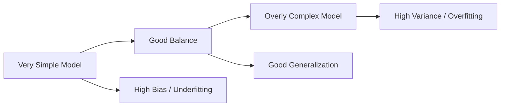
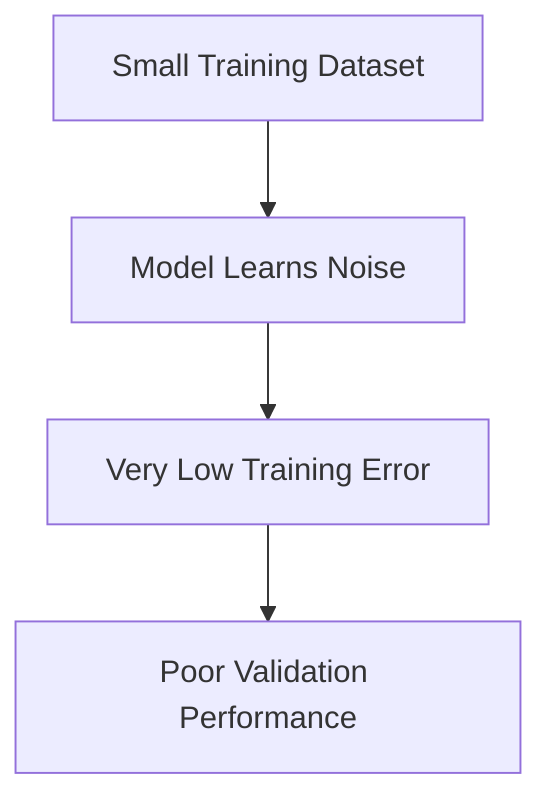
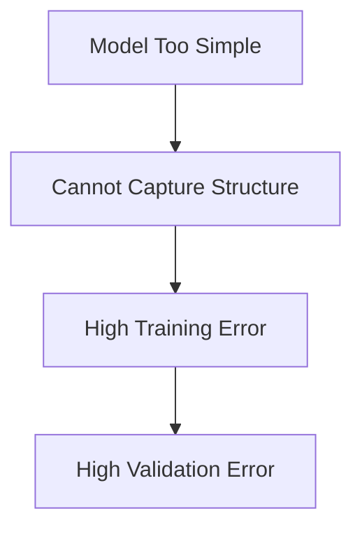
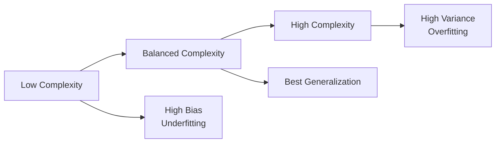

---
tags:
  - Machine Learning
  - Bias-Variance Tradeoff
  - Overfitting
  - Regularization
  - Deep Learning
---

# Overfitting, Underfitting, and the Bias–Variance Tradeoff

Author: Bidhya Yadav  
Audience: Scientists and ML practitioners transitioning from statistics to machine learning and deep learning

---

# 1. Big Picture

One of the central challenges in statistical modeling and machine learning is balancing:

```text
model simplicity ↔ model flexibility
```

This is commonly described as the:

```text
Bias–Variance Tradeoff
```

---

# 2. Core Intuition

## High Bias

The model is too simple to capture the underlying structure.

Result:

```text
underfitting
```

---

## High Variance

The model becomes too sensitive to the training data.

Result:

```text
overfitting
```

---

# 3. Visual Intuition



---

# 4. What We Actually Want

The goal is NOT:

```text
minimum training error
```

The real goal is:

```text
good generalization to unseen data
```

This is why validation and test datasets are important.

---

# 5. Overfitting — Error Due to Variance

An overfit model learns:

- true signal
- random noise
- accidental patterns
- dataset-specific artifacts

The model becomes overly specialized to the training set.

---

# 6. Typical Symptoms of Overfitting

```text
training error  << validation error
```

The model performs extremely well on training data but poorly on unseen data.

---

# 7. Learning Curve Intuition for Overfitting

As more training samples are added:

- training error generally worsens
- validation error generally improves

Eventually the two curves move closer together.

---

# 8. Overfitting Visualization



---

# 9. Why More Data Helps Overfitting

Adding more data usually:

- reduces sensitivity to noise
- improves statistical coverage
- stabilizes parameter estimation
- improves generalization

Large datasets make it harder for the model to memorize accidental patterns.

---

# 10. Common Causes of Overfitting

- too many features
- overly flexible models
- insufficient training data
- weak regularization
- noisy datasets
- excessive training epochs

---

# 11. Common Remedies for Overfitting

## Use Fewer Features

Reducing irrelevant or noisy features can improve generalization.

Feature selection techniques may help reduce variance.

---

## Use a Simpler Model

Model complexity and overfitting often increase together.

Examples:

- deep decision trees overfit more easily than shallow trees
- random forests are more flexible than linear regression
- very deep neural networks require more data

---

## Use More Training Samples

Additional data often improves generalization.

More data helps the model learn:

```text
true statistical structure
instead of dataset-specific noise
```

---

## Increase Regularization

Regularization discourages overly complex parameter configurations.

Examples:

- Ridge (L2)
- Lasso (L1)
- dropout in neural networks
- weight decay

Regularization often reduces variance.

---

# 12. Underfitting — Error Due to Bias

An underfit model is too simple to capture the underlying relationships.

The model lacks sufficient representational power.

---

# 13. Typical Symptoms of Underfitting

```text
training error is high
validation error is also high
```

The model performs poorly everywhere.

---

# 14. Learning Curve Intuition for Underfitting

As more training samples are added:

- training error may increase slightly
- validation error may improve slightly

However:

```text
both eventually converge to a relatively high error
```

This indicates the model itself is insufficient.

---

# 15. Underfitting Visualization



---

# 16. Common Causes of Underfitting

- insufficient model complexity
- too few features
- excessive regularization
- inadequate training
- oversimplified assumptions

---

# 17. Common Remedies for Underfitting

## Add More Features

Additional informative features may improve representational power.

Examples:

- interaction terms
- polynomial features
- domain-specific variables
- transformed variables

---

## Use a More Sophisticated Model

More flexible models can capture more complex relationships.

Examples:

```text
linear model
→ polynomial model
→ kernel methods
→ neural networks
```

---

## Decrease Regularization

Excessive regularization can overly constrain the model.

Reducing regularization may improve flexibility.

---

## Train Longer

Some models may simply require:

- additional optimization steps
- more epochs
- better convergence

especially in deep learning.

---

# 18. Important Clarification About More Data

For overfitting:

```text
more data usually helps
```

For underfitting:

```text
more data alone often does NOT solve the problem
```

because the model itself lacks sufficient capacity.

---

# 19. Bias–Variance Perspective



---

# 20. Connection to Deep Learning

The same principles apply in neural networks.

Increasing neural network capacity:

- reduces bias
- increases flexibility
- increases variance risk
- increases data requirements

Deep learning does NOT eliminate the bias–variance tradeoff.

It scales it.

---

# 21. Why This Matters in Real Scientific Work

Data collection is often:

- expensive
- slow
- resource intensive
- experimentally difficult

Understanding whether a model is:

- overfitting
- underfitting

can prevent enormous waste of time and computational resources.

---

# 22. Practical Mental Model

## Overfitting

```text
The model memorizes the training data.
```

---

## Underfitting

```text
The model cannot represent the underlying structure.
```

---

## Good Generalization

```text
The model captures the true statistical patterns
without memorizing noise.
```

---

# 23. Final Summary

| Situation | Training Error | Validation Error | Main Issue |
|---|---|---|---|
| Underfitting | High | High | High bias |
| Good fit | Low | Low | Good generalization |
| Overfitting | Very low | Higher | High variance |

---

# 24. Final Conceptual Takeaway

A central goal of machine learning is finding the right balance between:

```text
model simplicity
and
model flexibility
```

This balance determines whether the model:

- generalizes well,
- underfits,
- or overfits.
