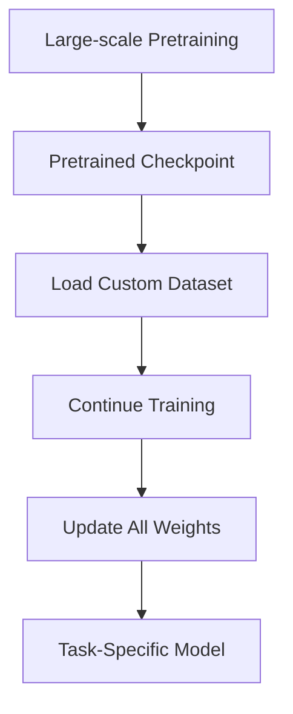
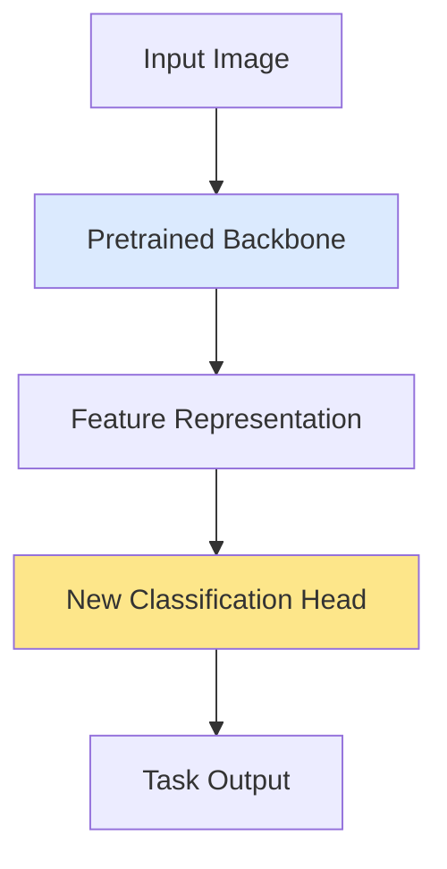
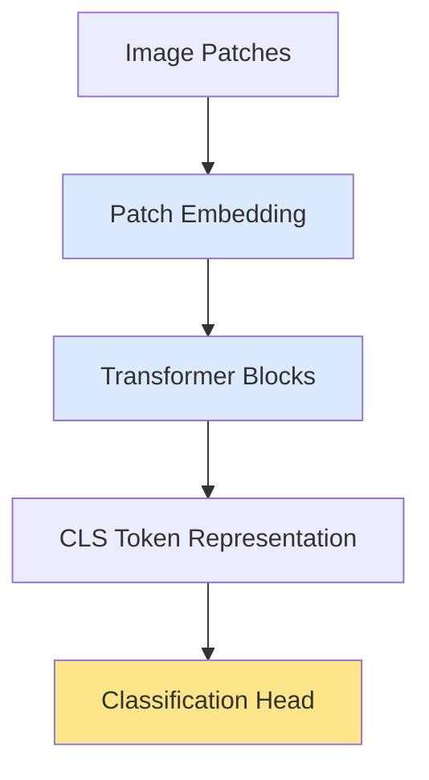

---
tags:
  - Fine-Tuning
  - Transfer Learning
  - PyTorch
  - Deep Learning
---

# Foundations of Model Adaptation: Full Fine-Tuning and Linear Probing Architectures

Author: Bidhya Yadav  
Topic Focus: Full Fine-Tuning (A) and Feature Extraction / Linear Probing (B)

---

# 1. Big Picture

Modern deep learning workflows rarely train large models from scratch.

Instead:

```text
Pretraining → Adaptation/Fine-Tuning → Deployment
```

A model is first trained on a very large generic dataset.
Later, the pretrained model is adapted for a more specific task.

Examples:

| Pretrained Model | Adapted Task |
|---|---|
| ResNet | Satellite image classification |
| ViT | Medical imaging |
| BERT | Sentiment classification |
| Whisper | Domain-specific speech recognition |

---

# 2. Mental Model

The most important intuition:

```text
Pretraining learns representations.
Fine-tuning specializes representations.
```

A pretrained model already knows many useful patterns.

Examples:

- language structure
- visual textures
- shapes
- semantics
- contextual relationships

Fine-tuning adapts these learned representations for a downstream task.

---

# 3. A — Full Fine-Tuning

## Core Idea

Full fine-tuning means:

```text
Load pretrained weights
→ Continue gradient-based training
→ Update ALL model parameters
```

In PyTorch:

```python
for p in model.parameters():
    p.requires_grad = True
```

Every layer updates during training.

---

# 4. Full Fine-Tuning Intuition

A useful analogy:

```text
Training from scratch:
Teaching a child language from birth
```

```text
Fine-tuning:
Teaching an educated adult a specialization
```

The pretrained model already understands general structure.
Fine-tuning specializes the model.

---

# 5. Full Fine-Tuning Workflow



---

# 6. Checkpoint Intuition

Fine-tuning can be viewed as:

```text
continuing training from someone else's checkpoint
```

Instead of:

```python
model = MyModel()
```

we do:

```python
model = AutoModel.from_pretrained(...)
```

The model weights are not random anymore.
They already contain learned representations.

---

# 7. Two Important Cases

## Case 1 — Continued Pretraining

The training objective stays the same.

Example:

```text
Original task:
masked language modeling
```

Continue training on:

- medical text
- legal text
- climate science papers

This is often called:

- continued pretraining
- domain adaptation
- DAPT

---

## Case 2 — Task Fine-Tuning

The objective changes.

Example:

```text
Pretrained BERT:
learned language representations
```

New task:

- sentiment classification
- question answering
- summarization
- NER

This is the most common meaning of “fine-tuning.”

---

# 8. Why Full Fine-Tuning Works

The pretrained model already learned:

- useful representations
- feature hierarchies
- semantic relationships
- latent structure

Fine-tuning modifies these representations slightly for a specific task.

---

# 9. Why Full Fine-Tuning Can Be Expensive

All parameters are updated.

For large models this means:

- large GPU memory usage
- optimizer states for all parameters
- longer training time
- more compute cost

This becomes difficult for modern large language models.

---

# 10. Why Full Fine-Tuning Still Matters

Full fine-tuning is still extremely useful when:

- the domain differs strongly from pretraining
- enough labeled data exists
- representation changes are necessary

Example:

```text
ImageNet model
→ satellite imagery classification
```

The model may need to adapt low-level representations.

Examples:

- snow textures
- multispectral imagery
- SAR patterns
- terrain morphology

---

# 11. Catastrophic Forgetting

One important issue:

```text
Fine-tuning can overwrite pretrained knowledge.
```

This is called:

```text
catastrophic forgetting
```

Especially likely when:

- learning rate is too high
- dataset is too small
- training is too aggressive

---

# 12. Transition to B

Full fine-tuning updates the entire network.

But researchers discovered something surprising:

```text
Pretrained representations are often already extremely useful.
```

This led to:

# B — Feature Extraction / Linear Probing

---

# 13. B — Core Idea

Instead of updating the entire model:

```text
freeze the backbone
train only a small task-specific head
```

The pretrained model becomes a:

```text
fixed feature extractor
```

---

# 14. Most Common Form of B

This is the canonical workflow.

## Step 1
Load pretrained model.

## Step 2
Remove or replace the task-specific head.

## Step 3
Freeze the backbone.

## Step 4
Train only the new head.

---

# 15. Visual Intuition



Blue:
- frozen pretrained backbone

Yellow:
- trainable new head

---

# 16. What Gets Replaced?

Usually only the final task-specific output layer.

Example:

Original ResNet trained on ImageNet:

```python
Linear(2048, 1000)
```

Your task:

```text
5 satellite classes
```

Replace with:

```python
Linear(2048, 5)
```

---

# 17. Important Clarification

The “head” usually means:

```text
task-specific output layer
```

NOT the internal Transformer feed-forward blocks.

Transformers still contain many internal FFN layers.
Those usually remain frozen during feature extraction.

---

# 18. Example: Vision Transformer



Frozen:

- patch embeddings
- transformer blocks

Trainable:

- final classification head

---

# 19. Why Feature Extraction Works

Pretrained models already learn strong representations.

For vision:

- edges
- textures
- shapes
- semantic structures

For language:

- syntax
- semantics
- contextual meaning

The new classifier only learns:

```text
how to map representations to labels
```

---

# 20. Representation Space Intuition

One of the deepest ideas in deep learning:

```text
The backbone learns a representation space.
The classifier learns decision boundaries.
```

Visual intuition:

```text
forest images → clustered together
urban images → clustered together
water images → clustered together
```

The classifier simply separates these clusters.

---

# 21. Why Linear Layers Often Work

Pretrained representations are often already separable.

Meaning:

```text
important information is already encoded
inside embedding space
```

A simple linear layer can therefore perform surprisingly well.

---

# 22. PyTorch Example

```python
model = torchvision.models.resnet50(pretrained=True)

for p in model.parameters():
    p.requires_grad = False

model.fc = nn.Linear(2048, num_classes)
```

Only:

```text
model.fc
```

updates during training.

---

# 23. Why B Became Popular

Feature extraction offers:

- faster training
- lower GPU usage
- fewer trainable parameters
- reduced overfitting
- strong performance on small datasets

---

# 24. Especially Useful for Small Datasets

Suppose you only have:

```text
2,000 satellite images
```

Full fine-tuning may overfit.

Feature extraction often generalizes better because:

```text
most pretrained knowledge remains preserved
```

---

# 25. A vs B

## A — Full Fine-Tuning

```text
Modify the representation space.
```

All weights update.

---

## B — Feature Extraction

```text
Reuse the representation space.
```

Only the classifier head updates.

---

# 26. Practical Tradeoff

## Use Feature Extraction When

- dataset is small
- compute is limited
- task resembles pretraining domain
- quick baseline is needed

---

## Use Full Fine-Tuning When

- domain differs strongly
- enough data exists
- higher accuracy is needed
- representations themselves must adapt

---

# 27. Intermediate Strategy (Common in Practice)

There is also a middle ground.

## Partial Fine-Tuning

Example:

```text
freeze early layers
train later layers
```

Why?

Early layers often learn generic patterns.
Later layers become more task-specific.

---

# 28. Gradual Unfreezing

A common workflow:

## Phase 1
Train only the new classifier head.

## Phase 2
Unfreeze upper layers.

Example:

```text
last 1–3 transformer blocks become trainable
```

This often improves performance while keeping compute manageable.

---

# 29. Final Mental Model

## Full Fine-Tuning

```text
Change the model's internal representations.
```

---

## Feature Extraction

```text
Reuse pretrained representations
and only learn a new mapping layer.
```

This distinction is the core intuition behind A vs B.
