---
tags:
  - PyTorch
  - CUDA
  - Distributed Training
  - HPC
  - Deep Learning
---

# Scaling Deep Learning: Hardware Acceleration, Memory Management, and Distributed (DDP) Architectures

## 1. System-Level Topology

Modern deep learning training is dominated by large tensor operations such as matrix multiplication, convolution, and attention. GPUs are designed for high-throughput parallel computation, which makes them well suited for neural network training.

At a high level:

```text
CPU: good at general-purpose control logic and sequential work
GPU: good at doing many similar numerical operations in parallel
```

Deep learning models repeatedly apply the same mathematical operations to large batches of data. This maps naturally to GPU hardware.

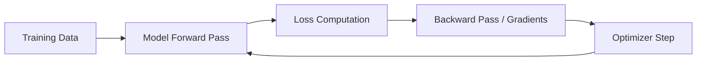

---

## 2. Why GPUs Are Useful for AI

GPUs are useful for AI because neural networks are mostly built from dense linear algebra.

Common GPU-accelerated operations include:

- matrix multiplication
- convolution
- attention
- normalization
- activation functions
- tensor reshaping and reductions

The most important operation in many models is matrix multiplication:

```text
Y = XW
```

where:

- `X` is input data
- `W` is model weights
- `Y` is output activations

These operations can be split into many small parallel computations, which GPUs handle efficiently.

---

## 3. CPU vs GPU Mental Model

A useful simplified view:

```text
CPU = few powerful workers
GPU = many simpler workers
```

CPUs are strong for:

- operating system tasks
- job orchestration
- data loading
- preprocessing
- control flow

GPUs are strong for:

- tensor math
- training neural networks
- large-batch inference
- matrix multiplication

In deep learning training, the CPU often feeds data to the GPU, while the GPU performs the heavy numerical computation.


---

## 4. Single-GPU Training

Single-GPU training is the simplest case.

A typical PyTorch workflow looks like:

```text
load data → move batch to GPU → forward pass → loss → backward pass → optimizer step
```

Conceptually:

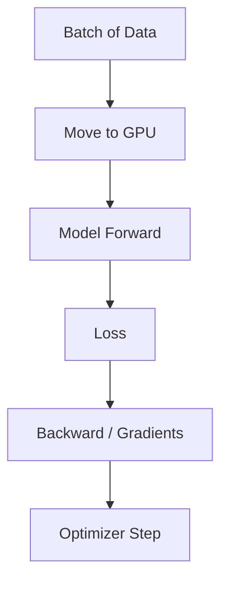

In PyTorch, this usually means:

```python
model = model.to("cuda")
inputs = inputs.to("cuda")
outputs = model(inputs)
loss = criterion(outputs, targets)
loss.backward()
optimizer.step()
```

Single-GPU training is easy to reason about, but it is limited by:

- GPU memory
- GPU compute capacity
- data loading speed
- training time

---

## 5. When One GPU Is Not Enough

Multiple GPUs may be needed when:

1. The model is too large for one GPU.
2. The batch size is too large for one GPU.
3. Training time on one GPU is too slow.
4. The dataset is very large.
5. The model is a large Transformer or other foundation model.

There are different ways to use multiple GPUs depending on the bottleneck.

---

## 6. Types of Multi-GPU Parallelism

The major categories are:

1. Data parallelism
2. Model parallelism
3. Tensor parallelism
4. Pipeline parallelism
5. Hybrid parallelism

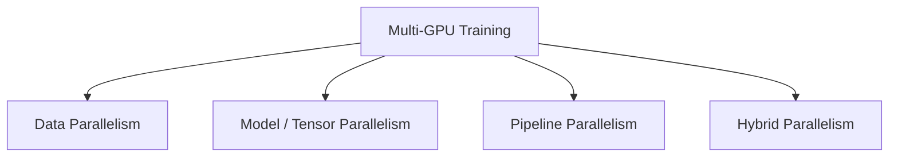

For many users and many research workflows, **data parallelism with PyTorch DistributedDataParallel (DDP)** is the most common starting point.

---

## 7. Data Parallelism

Data parallelism means:

```text
same model on each GPU
different data on each GPU
synchronize gradients after backward pass
```

Example with four GPUs:

```text
GPU0: model copy + batch A
GPU1: model copy + batch B
GPU2: model copy + batch C
GPU3: model copy + batch D
```

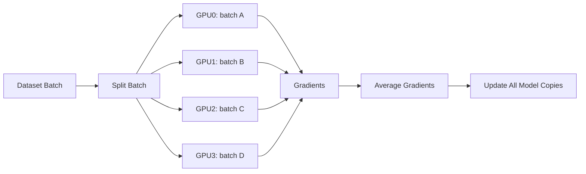

Each GPU computes gradients based on its own mini-batch. Then gradients are averaged so that all model copies remain synchronized.

---

## 8. Effective Batch Size

In data parallel training, the effective batch size increases with the number of GPUs.

```text
effective_batch_size = batch_size_per_gpu × number_of_gpus
```

Example:

```text
batch_size_per_gpu = 32
number_of_gpus = 4

effective_batch_size = 32 × 4 = 128
```

This matters because changing effective batch size can affect optimization behavior. Sometimes the learning rate or training schedule needs adjustment when scaling to many GPUs.

---

## 9. PyTorch DataParallel vs DistributedDataParallel

PyTorch has historically offered two common approaches:

1. `torch.nn.DataParallel`
2. `torch.nn.parallel.DistributedDataParallel`

`DataParallel` is simpler but generally not recommended for modern multi-GPU training. It uses one Python process and splits work across GPUs, often creating a bottleneck on the primary GPU.

`DistributedDataParallel` (DDP) is the recommended approach. It uses one process per GPU and performs efficient gradient synchronization.

```text
DataParallel:
1 process → multiple GPUs

DistributedDataParallel:
multiple processes → one GPU per process
```

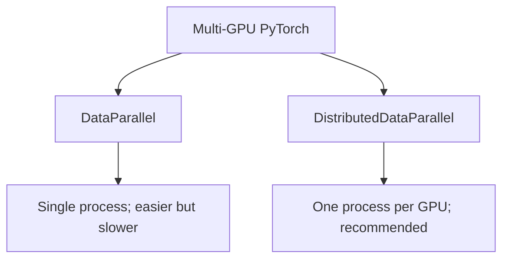

---

## 10. DDP Core Mental Model

The most useful mental model for DDP is:

```text
Each GPU has one process.
Each process has one model copy.
Each process receives different data.
Gradients are synchronized every training step.
```

With four GPUs:

```text
Process 0 → GPU0 → model copy → data shard A
Process 1 → GPU1 → model copy → data shard B
Process 2 → GPU2 → model copy → data shard C
Process 3 → GPU3 → model copy → data shard D
```

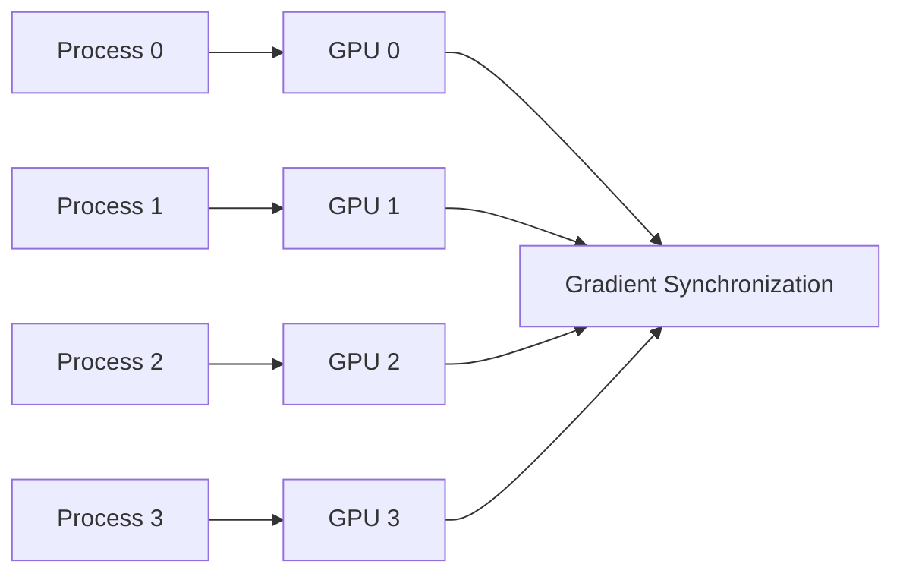

---

## 11. What `torchrun` Does

For DDP, you usually do not launch the script with plain `python train.py` when using multiple GPUs.

Instead, you use:

```bash
torchrun --nproc_per_node=4 train.py
```

This launches four Python processes on the node.

`torchrun` sets environment variables such as:

```text
LOCAL_RANK
RANK
WORLD_SIZE
```

Meaning:

- `LOCAL_RANK`: process index on the local node, often maps to local GPU ID
- `RANK`: global process index across all processes
- `WORLD_SIZE`: total number of processes

For one node with four GPUs:

```text
WORLD_SIZE = 4
RANK = 0, 1, 2, 3
LOCAL_RANK = 0, 1, 2, 3
```

---

## 12. Same Node Multi-GPU Training

When all GPUs are on the same physical node, communication happens through local GPU interconnects such as PCIe or NVLink.

Example:

```bash
torchrun --nproc_per_node=4 train.py
```

A common Slurm job request might look like:

```bash
#SBATCH --nodes=1
#SBATCH --gres=gpu:4
#SBATCH --cpus-per-task=8
```

Inside the job script:

```bash
torchrun --nproc_per_node=4 train.py
```

Same-node multi-GPU is generally easier and faster than multi-node training because communication stays within one machine.

---

## 13. Multi-Node Multi-GPU Training

Multi-node training extends the same DDP idea across multiple machines.

Example:

```text
4 nodes × 4 GPUs per node = 16 GPUs total
```

The conceptual model remains:

```text
one process per GPU
one model copy per process
different data per process
gradient synchronization across all processes
```

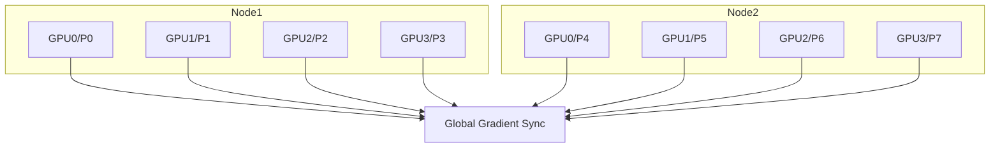

The main difference is that synchronization now crosses the network. This makes communication performance much more important.

---

## 14. Gradient Synchronization

In DDP, synchronization happens during the backward pass.

Each GPU computes gradients from its own data. Then DDP averages gradients across all processes.

Conceptually:

```text
final_gradient = average(gradient_GPU0, gradient_GPU1, gradient_GPU2, gradient_GPU3)
```

Then each process applies the same optimizer update.

This keeps all model copies identical.

Important point:

```text
Gradient synchronization happens every batch / step, not once per epoch.
```

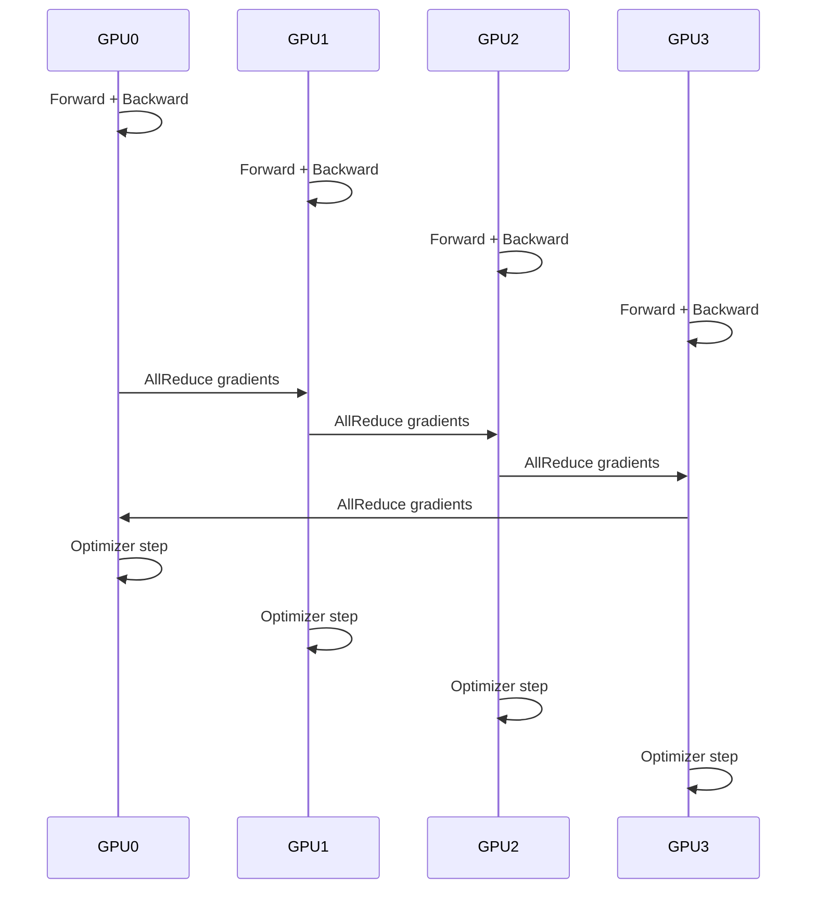

---

## 15. NCCL

NCCL stands for NVIDIA Collective Communications Library.

It is a communication backend optimized for GPU-to-GPU communication.

PyTorch DDP commonly uses NCCL for GPU training:

```python
dist.init_process_group("nccl")
```

NCCL handles collective operations such as:

- AllReduce
- Broadcast
- ReduceScatter
- AllGather

For DDP, the most important concept is AllReduce, which is used to combine gradients across GPUs.

---

## 16. AllReduce Intuition

AllReduce is a collective operation where all processes contribute values and all receive the combined result.

For gradient averaging:

```text
Each GPU contributes its gradients.
All GPUs receive the averaged gradients.
```

This avoids sending everything to one central GPU and helps communication scale better.

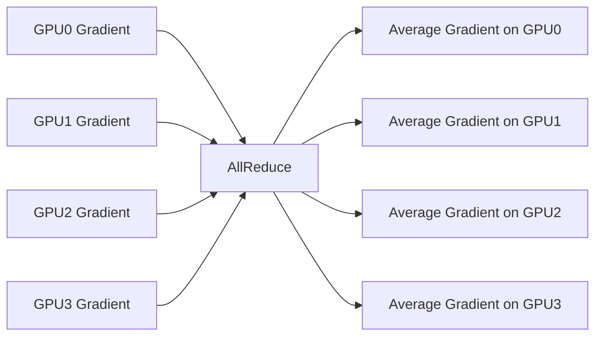

---

## 17. DistributedSampler

In DDP, each process should see a different slice of the dataset.

Without this, every GPU might train on the same examples, wasting computation.

PyTorch provides `DistributedSampler`:

```python
from torch.utils.data.distributed import DistributedSampler

sampler = DistributedSampler(dataset)
loader = DataLoader(dataset, sampler=sampler)
```

At the start of each epoch, it is common to call:

```python
sampler.set_epoch(epoch)
```

This ensures proper shuffling across epochs.

---

## 18. Minimal DDP Code Pattern

A simplified DDP structure:

```python
import os
import torch
import torch.distributed as dist
from torch.nn.parallel import DistributedDataParallel as DDP


def setup_distributed():
    distributed = "RANK" in os.environ

    if distributed:
        dist.init_process_group("nccl")
        local_rank = int(os.environ["LOCAL_RANK"])
        torch.cuda.set_device(local_rank)
        device = torch.device("cuda", local_rank)
    else:
        local_rank = 0
        device = torch.device("cuda" if torch.cuda.is_available() else "cpu")

    return distributed, local_rank, device


distributed, local_rank, device = setup_distributed()

model = MyModel().to(device)

if distributed:
    model = DDP(model, device_ids=[local_rank])
```

This pattern allows the same script to run in single-GPU or multi-GPU mode.

---

## 19. Single GPU as a Special Case

A robust training script can treat single-GPU training as a special case of distributed training.

Typical execution modes:

```bash
python train.py
```

for single GPU, or:

```bash
torchrun --nproc_per_node=4 train.py
```

for four GPUs.

The code can detect whether distributed variables exist and adapt automatically.

This is useful because the same core training script can scale from a local workstation to an HPC node.

---

## 20. Slurm and GPU Allocation

On HPC systems, Slurm allocates GPUs as scheduled resources.

A job may request GPUs like this:

```bash
#SBATCH --gres=gpu:1
```

or:

```bash
#SBATCH --gres=gpu:4
```

Slurm controls which GPUs are visible to the job using environment variables such as:

```text
CUDA_VISIBLE_DEVICES
```

If a node has four GPUs and a job requests two, Slurm may expose only two GPUs to that job.

Inside the job, PyTorch sees those assigned GPUs as logical device IDs starting from 0.

---

## 21. Node Sharing and GPU Allocation

If a node has multiple GPUs, Slurm may allow multiple users to share the node as long as resources do not conflict.

Example:

```text
Node has 4 GPUs
User A requests 2 GPUs
User B requests 1 GPU
```

Both jobs may run on the same node if enough CPU, memory, and GPU resources remain.

If a node has only one GPU and two users each request one GPU, both GPU jobs should not run at the same time on that node. One job should wait until the GPU is free.

A GPU job and a CPU-only job can often share the same node if the cluster policy allows it, because only one job needs the GPU.

---

## 22. Example Slurm Script: Single GPU

```bash
#!/bin/bash
#SBATCH --job-name=single_gpu_train
#SBATCH --nodes=1
#SBATCH --gres=gpu:1
#SBATCH --cpus-per-task=8
#SBATCH --time=02:00:00
#SBATCH --output=single_gpu_%j.out

module load cuda
conda activate myenv

python train.py
```

This runs one Python process using one GPU.

---

## 23. Example Slurm Script: Single Node, Multi-GPU DDP

```bash
#!/bin/bash
#SBATCH --job-name=ddp_single_node
#SBATCH --nodes=1
#SBATCH --gres=gpu:4
#SBATCH --cpus-per-task=8
#SBATCH --time=02:00:00
#SBATCH --output=ddp_%j.out

module load cuda
conda activate myenv

torchrun --nproc_per_node=4 train.py
```

This launches four processes, one per GPU.

---

## 24. Example Slurm Script: Multi-Node DDP Concept

A multi-node DDP script requires coordination between nodes. The exact script depends on cluster configuration, but conceptually it needs:

- number of nodes
- processes per node
- master address
- master port
- node rank

Example structure:

```bash
#!/bin/bash
#SBATCH --job-name=ddp_multi_node
#SBATCH --nodes=2
#SBATCH --gres=gpu:4
#SBATCH --ntasks-per-node=1
#SBATCH --cpus-per-task=16
#SBATCH --time=04:00:00
#SBATCH --output=ddp_multinode_%j.out

module load cuda
conda activate myenv

MASTER_ADDR=$(scontrol show hostnames $SLURM_JOB_NODELIST | head -n 1)
MASTER_PORT=29500
NNODES=$SLURM_JOB_NUM_NODES
NPROC_PER_NODE=4
NODE_RANK=$SLURM_NODEID

torchrun \
  --nnodes=$NNODES \
  --nproc_per_node=$NPROC_PER_NODE \
  --node_rank=$NODE_RANK \
  --master_addr=$MASTER_ADDR \
  --master_port=$MASTER_PORT \
  train.py
```

Some clusters prefer launching with `srun`; others use `torchrun` directly inside the allocation. The best approach depends on site policy.

---

## 25. Failure Behavior in DDP

Standard DDP is synchronous and not fault tolerant by default.

This means:

```text
slow GPU → all GPUs wait
failed GPU/process → whole job usually fails
```

DDP does not automatically remove a bad GPU or redistribute its data to other GPUs.

The usual mitigation is checkpointing.

---

## 26. Checkpointing

Checkpointing periodically saves training state so that a failed job can restart from the last saved point.

A useful checkpoint may include:

- model weights
- optimizer state
- scheduler state
- epoch number
- random number generator states

In DDP, usually only rank 0 saves the checkpoint to avoid multiple processes writing the same file.

Example pattern:

```python
if not distributed or dist.get_rank() == 0:
    torch.save(checkpoint, "checkpoint.pt")
```

When using DDP, the underlying model may be accessed as:

```python
model.module
```

because DDP wraps the original model.

---

## 27. Straggler Problem

Because DDP is synchronous, all processes must reach synchronization points together.

If one GPU is slow, all other GPUs wait.

Causes of stragglers include:

- uneven data loading
- slow storage access
- overloaded CPU
- hardware differences
- network issues
- thermal throttling

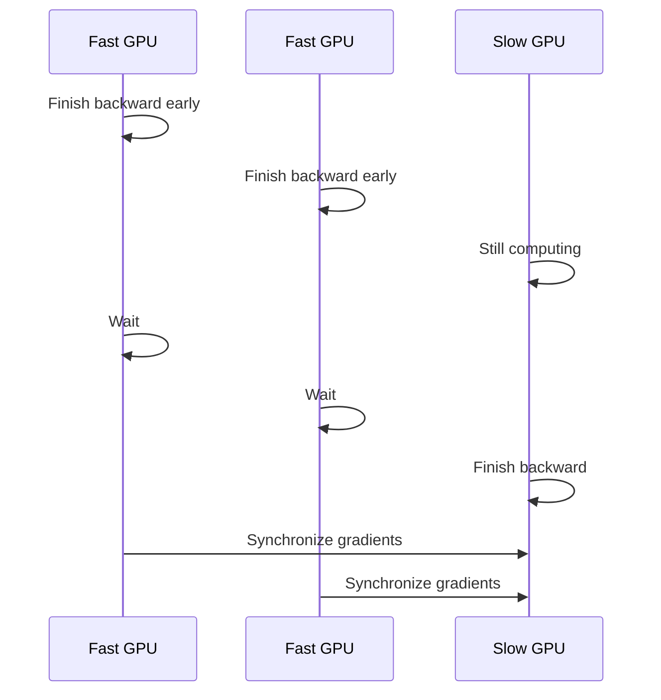

---

## 28. Common Bottlenecks

Multi-GPU training can be limited by several bottlenecks.

### GPU compute bottleneck
The model is using the GPU heavily and training speed is limited by GPU math throughput.

### GPU memory bottleneck
The model or batch size is too large for GPU memory.

### Data loading bottleneck
The GPU waits for the CPU or storage system to prepare batches.

### Communication bottleneck
GPUs spend too much time synchronizing gradients.

### Network bottleneck
In multi-node training, inter-node communication may limit scaling.

---

## 29. Common Debugging Scenarios

### Only one GPU is being used
Likely causes:

- launched with `python train.py` instead of `torchrun`
- model not wrapped in DDP
- code hardcoded to one GPU

### Multi-GPU job is slower than expected
Likely causes:

- data loading bottleneck
- too small batch size per GPU
- excessive communication
- slow storage
- imbalance across processes

### DDP job hangs
Likely causes:

- one process crashed silently
- mismatch in number of processes
- all processes did not call the same collective operation
- networking or NCCL issue
- different code path on different ranks

### Out of memory
Likely fixes:

- reduce batch size
- use mixed precision
- use gradient checkpointing
- use model/tensor parallelism
- reduce sequence length

---

## 30. Relationship to OpenMP, MPI, Dask, and Joblib

Traditional HPC often uses MPI and OpenMP.

OpenMP:

```text
shared-memory threading within a node
```

MPI:

```text
process-based distributed communication across nodes
```

PyTorch DDP is conceptually closer to MPI because it uses multiple processes and collective communication. However, users usually do not write MPI code directly.

Dask and joblib are higher-level Python tools for parallelism.

A useful mapping:

```text
joblib → high-level local parallelism
dask → high-level distributed task parallelism
DDP → distributed synchronous deep learning training
MPI → lower-level distributed message passing
OpenMP → lower-level shared-memory threading
```

---

## 31. Training vs Inference on GPUs

Training requires:

- forward pass
- loss computation
- backward pass
- gradient synchronization
- optimizer update

Inference usually requires:

- forward pass only

Training is typically much more memory-intensive because it must store activations for backpropagation.

For decoder-only Transformers, inference generates one token at a time, often using a KV cache to avoid recomputing previous attention keys and values.

---

## 32. Large Transformer Training and GPUs

Large Transformer training may require more than data parallelism.

Reasons:

- model too large for one GPU
- optimizer states too large
- activation memory too large
- sequence length too long

Additional strategies include:

- mixed precision training
- gradient checkpointing
- tensor parallelism
- pipeline parallelism
- ZeRO optimizer sharding
- fully sharded data parallelism

These techniques reduce memory pressure and/or distribute model components across GPUs.

---

## 33. Model Parallelism

Model parallelism splits the model across GPUs.

Example:

```text
GPU0 → first layers
GPU1 → later layers
```

This is useful when the model does not fit on one GPU.

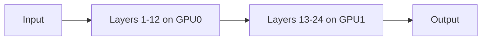

The downside is that GPUs may wait on each other unless carefully pipelined.

---

## 34. Tensor Parallelism

Tensor parallelism splits individual matrix operations across GPUs.

Instead of putting different layers on different GPUs, a single large layer may be partitioned.

Example:

```text
Large weight matrix split across multiple GPUs
```

This is common in very large language model training.

---

## 35. Pipeline Parallelism

Pipeline parallelism splits model layers into stages and sends micro-batches through them.

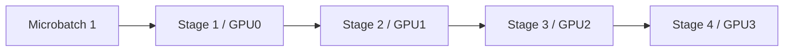

It improves utilization compared with simple layer splitting, but introduces scheduling complexity and pipeline bubbles.

---

## 36. Hybrid Parallelism

Large-scale training often combines multiple methods:

```text
data parallelism + tensor parallelism + pipeline parallelism + optimizer sharding
```

For example:

- data parallelism across groups of nodes
- tensor parallelism within a node
- pipeline parallelism across layers
- optimizer states sharded across processes

This is common for very large Transformer models.

---

## 37. Practical Mental Models

### Single GPU

```text
one process → one GPU → one model → one batch at a time
```

### Single Node Multi-GPU DDP

```text
N processes → N GPUs → N model copies → different data → gradient averaging
```

### Multi-Node DDP

```text
same as above, but processes are spread across nodes and synchronize over the network
```

### Data Parallelism

```text
split data, replicate model
```

### Model Parallelism

```text
split model, coordinate computation
```

### Pipeline Parallelism

```text
split model into stages, stream micro-batches
```

---

## 38. Key Terms Glossary

**GPU**: Graphics Processing Unit; accelerates parallel tensor computation.

**CUDA**: NVIDIA programming platform for GPU computing.

**CUDA_VISIBLE_DEVICES**: Environment variable controlling which GPUs are visible to a process.

**DDP**: DistributedDataParallel; PyTorch's recommended multi-GPU training approach.

**Rank**: Global ID of a distributed process.

**Local rank**: Process ID within a node, usually used to select the local GPU.

**World size**: Total number of distributed processes.

**NCCL**: NVIDIA communication library used for GPU collectives.

**AllReduce**: Collective operation that combines values across processes and returns the result to all processes.

**DistributedSampler**: PyTorch sampler that partitions data across DDP processes.

**Effective batch size**: Batch size per GPU multiplied by number of GPUs.

**Straggler**: A slow process or GPU that causes others to wait.

**Checkpoint**: Saved training state used for recovery or resuming training.

**Data parallelism**: Replicate model, split data.

**Model parallelism**: Split model across GPUs.

**Tensor parallelism**: Split individual tensor operations across GPUs.

**Pipeline parallelism**: Split layers into stages and stream micro-batches.

**Mixed precision**: Use lower precision such as FP16/BF16 to reduce memory and improve speed.

---

## 39. Summary

GPU training starts with a simple idea: use GPUs for parallel tensor computation. Single-GPU training is straightforward, but scaling to multiple GPUs requires coordinating multiple devices.

The most common modern approach is PyTorch DistributedDataParallel, where each GPU is controlled by its own process, each process trains on different data, and gradients are synchronized every training step using NCCL collectives such as AllReduce.

Multi-GPU training can happen within one node or across many nodes. The mental model remains similar, but multi-node training introduces network communication and more failure modes. DDP is synchronous, so slow or failed workers affect the whole job. Practical robustness comes from good resource allocation, balanced data loading, monitoring, and checkpointing.

For very large models, data parallelism may not be enough. Techniques such as model parallelism, tensor parallelism, pipeline parallelism, mixed precision, and sharding are used to fit and train models at scale.

---

## 40. One-Line Summary

GPU training accelerates deep learning by parallelizing tensor operations, and multi-GPU training scales this by distributing work across GPUs while synchronizing model updates through mechanisms such as PyTorch DDP and NCCL AllReduce.
