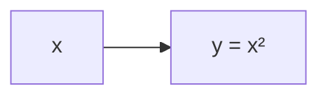
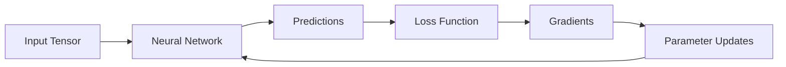
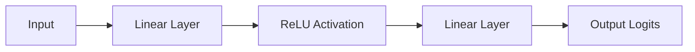
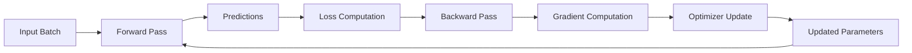

---
tags:
  - PyTorch
  - Deep Learning
  - Neural Networks
  - Training
---

# Deep Learning with PyTorch — Foundations and Training Loops

Author: Bidhya Yadav  
Focus: Understanding Deep Learning Mechanics from First Principles

---

# 1. Big Picture

Modern deep learning is fundamentally:

```text
large differentiable tensor programs
optimized using gradient descent
```

PyTorch provides the framework for:

- tensor computation
- automatic differentiation
- neural network construction
- optimization
- GPU acceleration

---

# 2. Core Learning Goal

The objective is NOT merely learning APIs.

The objective is to understand:

```text
How neural networks actually learn.
```

Specifically:

- tensor transformations
- gradients
- backpropagation
- optimization
- training loops
- parameter updates

---

# 3. Tensors

## What Is a Tensor?

A tensor is:

```text
a multidimensional numerical array
```

Examples:

---

## Scalar (0D)

```text
5
```

---

## Vector (1D)

```text
[1, 2, 3]
```

Shape:

```python
(3,)
```

---

## Matrix (2D)

```text
[
 [1, 2],
 [3, 4]
]
```

Shape:

```python
(2, 2)
```

---

## Higher-Dimensional Tensor

Example image batch:

```python
(batch, channels, height, width)
```

Example:

```python
(32, 3, 224, 224)
```

Meaning:

- batch size = 32
- RGB channels = 3
- image size = 224×224

---

# 4. Tensor Creation in PyTorch

```python
import torch
```

---

## Create Tensor

```python
x = torch.tensor([1, 2, 3])
```

---

## Random Tensor

```python
x = torch.randn(3, 4)
```

Meaning:

```text
3 rows × 4 columns
random normal values
```

---

# 5. Tensor Shapes

Tensor shape debugging is one of the most important practical skills.

```python
print(x.shape)
```

Example:

```python
torch.Size([3, 4])
```

A large fraction of deep learning debugging involves:

```text
checking tensor dimensions
```

---

# 6. Tensor Operations

Deep learning is fundamentally repeated tensor transformations.

---

## Addition

```python
a = torch.tensor([1, 2])
b = torch.tensor([3, 4])

c = a + b
```

---

## Matrix Multiplication

```python
a = torch.randn(2, 3)
b = torch.randn(3, 4)

c = a @ b
```

Output shape:

```python
(2, 4)
```

This operation is central to neural networks.

---

# 7. Neural Networks as Tensor Transformations

A neural network layer is essentially:

```text
y = Wx + b
```

Where:

- `x` = input tensor
- `W` = weight matrix
- `b` = bias vector
- `y` = output tensor

This is fundamentally:

```text
matrix multiplication + addition
```

---

# 8. Learnable Parameters

Parameters are:

```text
learnable tensors
```

Example:

```python
W = torch.randn(10, 5)
```

Training adjusts these parameters to reduce error.

---

# 9. Autograd — PyTorch's Core Superpower

PyTorch automatically computes gradients.

Example:

```python
x = torch.tensor(2.0, requires_grad=True)

y = x ** 2
```

PyTorch internally builds a computational graph.

---

# 10. Computational Graph



Calling:

```python
y.backward()
```

computes:

```text
dy/dx
```

Result:

```python
print(x.grad)
```

Output:

```text
4
```

because:

```text
d(x²)/dx = 2x
```

---

# 11. What Gradients Mean

A gradient tells us:

```text
How should a parameter change
in order to reduce loss?
```

Without gradients:

- no learning
- no backpropagation
- no deep learning

---

# 12. The Big Deep Learning Cycle



---

# 13. PyTorch Neural Networks — `nn.Module`

PyTorch neural networks are built using:

```python
nn.Module
```

Think of `nn.Module` as:

```text
PyTorch's neural network infrastructure system
```

It provides:

- parameter tracking
- GPU support
- gradient integration
- model saving/loading
- train/eval switching

---

# 14. Basic Neural Network Example

```python
import torch
import torch.nn as nn

class SimpleNet(nn.Module):

    def __init__(self):
        super().__init__()

        self.fc1 = nn.Linear(4, 8)
        self.relu = nn.ReLU()
        self.fc2 = nn.Linear(8, 2)

    def forward(self, x):

        x = self.fc1(x)
        x = self.relu(x)
        x = self.fc2(x)

        return x
```

---

# 15. Understanding `__init__()`

```python
def __init__(self):
```

is the constructor.

It runs automatically when creating the model:

```python
model = SimpleNet()
```

This is where layers are defined.

---

# 16. Understanding `self`

Example:

```python
self.fc1 = nn.Linear(4, 8)
```

means:

```text
attach this layer permanently to this model object
```

Without `self`, the layer would disappear after initialization.

---

# 17. Understanding `super().__init__()`

This line is extremely important:

```python
super().__init__()
```

Meaning:

```text
Run nn.Module's initialization code.
```

This initializes PyTorch internal machinery:

- parameter registration
- gradient tracking
- state handling
- module bookkeeping

Without this, many PyTorch features break.

---

# 18. Forward Pass

```python
def forward(self, x):
```

defines:

```text
how tensors flow through the network
```

This is the actual neural computation.

---

# 19. Neural Network Flow



---

# 20. Why Activations Matter

Without activations:

```text
linear → linear → linear
```

collapses into:

```text
just another linear transformation
```

Nonlinear activations like ReLU give neural networks expressive power.

---

# 21. ReLU

Most common activation function:

```text
ReLU(x) = max(0, x)
```

PyTorch:

```python
nn.ReLU()
```

---

# 22. Logits

Neural networks usually output:

```text
logits
```

These are:

```text
raw unnormalized scores
```

Example:

```python
tensor([2.1, -0.3, 0.7])
```

Not probabilities yet.

---

# 23. Softmax

Converts logits into probabilities.

```python
probs = torch.softmax(logits, dim=-1)
```

Output probabilities sum to 1.

---

# 24. Loss Functions

Loss measures:

```text
how wrong predictions are
```

Training tries to minimize loss.

---

# 25. Cross Entropy Loss

Very common for classification.

```python
criterion = nn.CrossEntropyLoss()
```

Usage:

```python
loss = criterion(outputs, targets)
```

Important:

```text
Do NOT apply softmax manually before CrossEntropyLoss.
```

PyTorch handles this internally.

---

# 26. Optimizers

Optimizers update parameters using gradients.

Example:

```python
optimizer = torch.optim.Adam(
    model.parameters(),
    lr=1e-3
)
```

Conceptually:

```text
parameter = parameter - learning_rate × gradient
```

---

# 27. The Full Training Loop

This is the heart of practical deep learning.

```python
for epoch in range(num_epochs):

    for inputs, targets in dataloader:

        optimizer.zero_grad()

        outputs = model(inputs)

        loss = criterion(outputs, targets)

        loss.backward()

        optimizer.step()
```

---

# 28. Training Loop Visualization



---

# 29. Step-by-Step Explanation

## Step 1 — Forward Pass

```python
outputs = model(inputs)
```

Model computes predictions.

---

## Step 2 — Compute Loss

```python
loss = criterion(outputs, targets)
```

Measure prediction error.

---

## Step 3 — Clear Old Gradients

```python
optimizer.zero_grad()
```

PyTorch accumulates gradients by default.
Old gradients must be cleared.

---

## Step 4 — Backpropagation

```python
loss.backward()
```

PyTorch computes gradients for all parameters.

---

## Step 5 — Parameter Update

```python
optimizer.step()
```

Optimizer updates weights using gradients.

---

# 30. Epochs

One epoch means:

```text
one full pass through the dataset
```

Example:

```text
10,000 training samples
```

One epoch:

```text
model sees all 10,000 once
```

---

# 31. Batches

Training usually uses mini-batches.

Example:

```text
batch size = 32
```

Meaning:

```text
32 samples processed together
```

Benefits:

- efficient GPU computation
- lower memory usage
- faster optimization

---

# 32. DataLoader

PyTorch automates batching using:

```python
DataLoader
```

Example:

```python
from torch.utils.data import TensorDataset, DataLoader

dataset = TensorDataset(X, y)

dataloader = DataLoader(
    dataset,
    batch_size=16,
    shuffle=True
)
```

---

# 33. Why Shuffle Data?

```python
shuffle=True
```

helps avoid:

- ordering bias
- repetitive gradient patterns
- poor convergence

---

# 34. Training vs Inference

Very important distinction.

---

## Training Mode

```python
model.train()
```

Enables:

- dropout
- batchnorm updates
- gradient behavior for training

---

## Evaluation Mode

```python
model.eval()
```

Disables:

- dropout randomness
- batchnorm updates

Used for inference and validation.

---

# 35. `torch.no_grad()`

Inference often uses:

```python
with torch.no_grad():
    outputs = model(inputs)
```

Benefits:

- lower memory usage
- faster inference
- no gradient tracking

---

# 36. Common Beginner Mistakes

## Forgetting `zero_grad()`

Causes incorrect gradient accumulation.

---

## Applying Softmax Before CrossEntropyLoss

Usually incorrect.

---

## Forgetting `model.eval()`

Causes inconsistent inference behavior.

---

## Tensor Shape Mismatches

Extremely common.

Always inspect:

```python
print(x.shape)
```

---

# 37. Deep Mental Model

Deep learning training is fundamentally:

```text
iteratively adjusting parameters using gradients
in order to reduce prediction error
```

Everything else is refinement and engineering.

---

# 38. Final Conceptual Summary

## Tensors

Represent multidimensional numerical data.

---

## Neural Networks

Parameterized tensor transformation systems.

---

## Forward Pass

Computes predictions.

---

## Loss Function

Measures prediction error.

---

## Backpropagation

Computes gradients.

---

## Optimizer

Updates parameters.

---

## Training Loop

Repeated optimization cycle over data batches.

---

# 39. Why Multiple Epochs Help

The dataset stays the same, but the model parameters change after every batch update.

So each epoch trains a slightly improved version of the model.

Training is gradual:

```text
predictions → loss → gradients → parameter updates
```

Each epoch produces new gradients because the model itself has changed.

Mini-batches also provide noisy gradient estimates, so repeated passes help stabilize and refine learning.

Too many epochs can eventually cause overfitting:

```text
training loss ↓
validation loss ↑
```

Final intuition:

```text
Each epoch revisits the same data using improved parameters,
allowing the model to progressively refine its representations.
```

# 40. Recommended Next Topics

Natural next steps:

1. Backpropagation and chain rule intuition
2. Optimization algorithms (SGD vs Adam)
3. Vanishing/exploding gradients
4. Regularization
5. CNNs
6. Transformers
7. Attention mechanisms
8. Transfer learning
9. Fine-tuning
10. Distributed training
