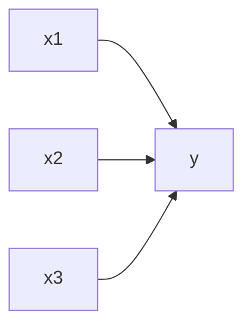
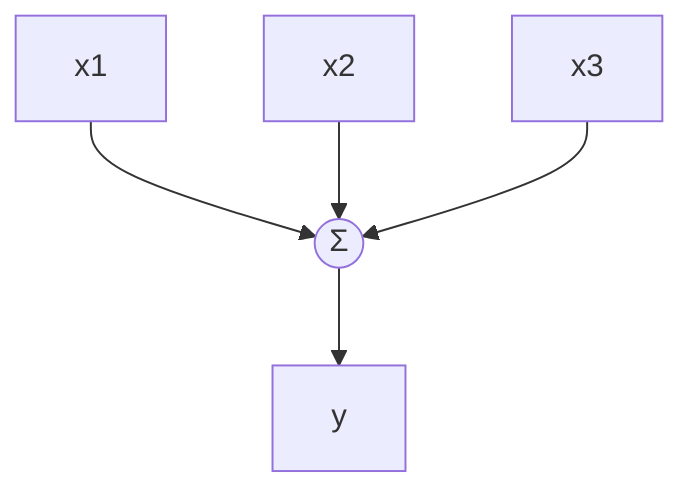
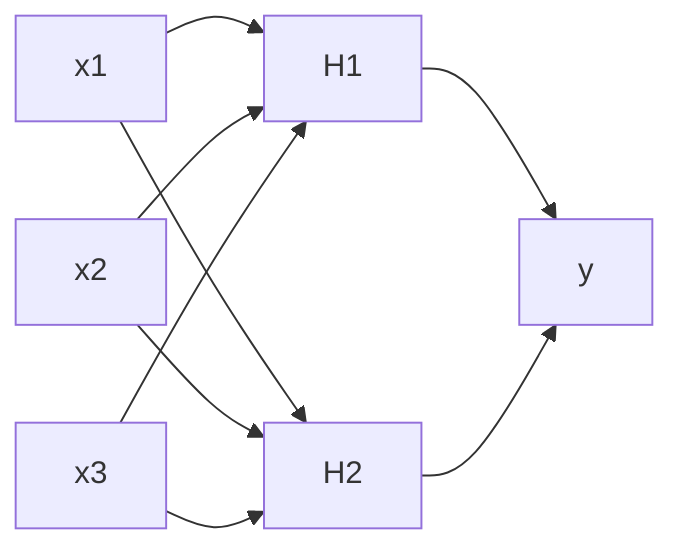
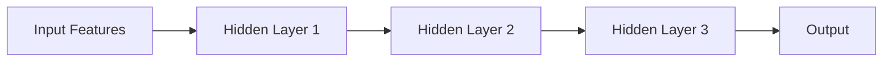
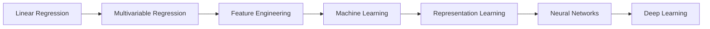

---
tags:
  - Statistics
  - Machine Learning
  - Deep Learning
  - Foundations
---

# From Statistics to Machine Learning to Neural Networks

Author: Bidhya Yadav  
Audience: Domain scientists with background in statistics and classical machine learning

---

# 1. Big Picture

Deep learning did not emerge independently from statistics.

It evolved naturally from:

```text
Statistics
→ Machine Learning
→ Representation Learning
→ Deep Learning
```

The mathematical foundations remain strongly connected.

The key progression is:

```text
simple parameterized models
→ higher-dimensional feature spaces
→ learned nonlinear representations
```

---

# 2. Starting Point — Linear Regression

The simplest predictive model:

```text
y = Wx + b
```

Where:

- `x` = input variable
- `W` = weight (slope)
- `b` = bias/intercept
- `y` = predicted output

This is fundamentally:

```text
weighted linear combination of inputs
```

---

# 3. Multivariable Regression

Real scientific systems usually involve many variables.

The equation expands naturally:

```text
y = w1x1 + w2x2 + w3x3 + ... + wnxn + b
```

Or compactly:

```text
y = Wx + b
```

Where:

- `x` becomes a feature vector
- `W` becomes a parameter vector

---

# 4. Important Scientific Interpretation

In many scientific disciplines:

```text
features = observations or measured variables
```

Examples:

- temperature
- pressure
- salinity
- reflectance
- elevation
- spectral bands

Classical statistical modeling often begins with:

```text
carefully selecting meaningful features
```

---

# 5. Feature Engineering

Scientists often improve models through:

```text
feature engineering
```

Examples:

```text
x1²
log(x2)
x3*x4
sin(x5)
```

These transformations introduce:

- nonlinear relationships
- interactions
- domain knowledge

---

# 6. Statistical Interaction Terms

Interaction terms are already a primitive form of representation engineering.

Example:

```text
y = w1x1 + w2x2 + w3(x1*x2) + b
```

Meaning:

```text
The effect of x1 depends on x2.
```

This idea becomes extremely important later in neural networks.

---

# 7. Classical ML Perspective

Many classical ML models can still be viewed as:

```text
parameter estimation systems
```

The primary goal remains:

```text
find parameter values that minimize prediction error
```

Examples:

- linear regression
- ridge regression
- lasso
- logistic regression
- SVMs

The models differ mainly in:

- functional form
- regularization
- optimization strategy
- feature representation

---

# 8. Curse of Dimensionality

Adding more features can improve expressiveness.

But excessive dimensionality creates problems:

- sparse data coverage
- overfitting
- unstable estimation
- increased variance

This is the:

```text
curse of dimensionality
```

A central challenge in statistics and ML.

---

# 9. Core Insight Connecting Statistics and Deep Learning

A neural network is still fundamentally built from:

```text
y = Wx + b
```

The difference is:

```text
neural networks repeatedly compose these transformations
```

with nonlinear activations.

---

# 10. Linear Regression as a Single Neuron

A single neuron can be viewed as:

```text
ŷ = activation(Wx + b)
```

Without the activation function:

```text
it reduces to linear regression
```

---

# 11. Flipping Linear Regression into a Neural Network

A multivariable regression equation:

```text
y = w1x1 + w2x2 + w3x3 + b
```

can be visualized horizontally:



The same system can be drawn vertically as a neuron:



The weighted summation node computes:

```text
Wx + b
```

---

# 12. Why Neural Networks Need Nonlinearity

Stacking purely linear transformations:

```text
linear → linear → linear
```

still produces:

```text
another linear transformation
```

Therefore deep learning requires:

```text
nonlinear activation functions
```

Examples:

- ReLU
- sigmoid
- tanh
- GELU

---

# 13. Expanding Vertically — Wider Representations

Increasing the number of neurons in a layer increases representational capacity.



This resembles:

```text
expanding engineered feature spaces
```

similar to adding:

- interaction terms
- polynomial terms
- basis expansions

in classical statistics.

---

# 14. Hidden Layers as Learned Feature Engineering

One of the most important conceptual transitions:

## Classical Statistics / ML

Humans engineer features manually.

Example:

```text
x1²
x1*x2
log(x3)
```

---

## Neural Networks

The model learns useful transformations automatically.

Hidden layers become:

```text
learned feature generators
```

This is the essence of:

```text
representation learning
```

---

# 15. Expanding Horizontally — Depth

Adding more hidden layers creates depth.



Depth enables:

```text
hierarchical feature learning
```

---

# 16. Hierarchical Representations

Deep networks progressively learn more abstract features.

Example in image analysis:

```text
pixels
→ edges
→ textures
→ shapes
→ objects
→ scenes
```

Each layer builds on previous representations.

---

# 17. Why More Depth Requires More Data

Increasing model capacity increases:

- flexibility
- representation power
- parameter count

But also increases:

- overfitting risk
- variance
- data requirements

This is a continuation of familiar statistical tradeoffs.

---

# 18. Bias-Variance Intuition Still Applies

The same statistical principles remain valid.

## Small/simple models

- high bias
- lower variance
- limited flexibility

---

## Large/deep models

- lower bias
- higher variance
- more expressive
- require more data

Deep learning does not eliminate these tradeoffs.

It scales them.

---

# 19. Neural Networks as Generalized Function Approximation

A neural network can be viewed as:

```text
a highly flexible parameterized function
```

Training attempts to estimate parameter values that best map:

```text
inputs → outputs
```

using gradient-based optimization.

---

# 20. Optimization Remains Central

Across statistics, ML, and deep learning:

```text
parameter estimation is the central problem
```

The difference is primarily:

| Area | Typical Complexity |
|---|---|
| Linear regression | small parameter space |
| Classical ML | moderate complexity |
| Deep learning | massive nonlinear parameter spaces |

---

# 21. Deep Learning Is Not "Magic"

Deep learning systems are fundamentally:

```text
large differentiable parameterized systems
optimized using gradient descent
```

The core concepts remain connected to:

- regression
- optimization
- statistical estimation
- feature representation

---

# 22. Final Conceptual Progression



---

# 23. Final Mental Model

A useful unifying intuition:

```text
Statistics:
manually design useful representations.
```

```text
Machine Learning:
optimize parameterized predictive systems.
```

```text
Deep Learning:
automatically learn hierarchical representations
through large-scale nonlinear optimization.
```
