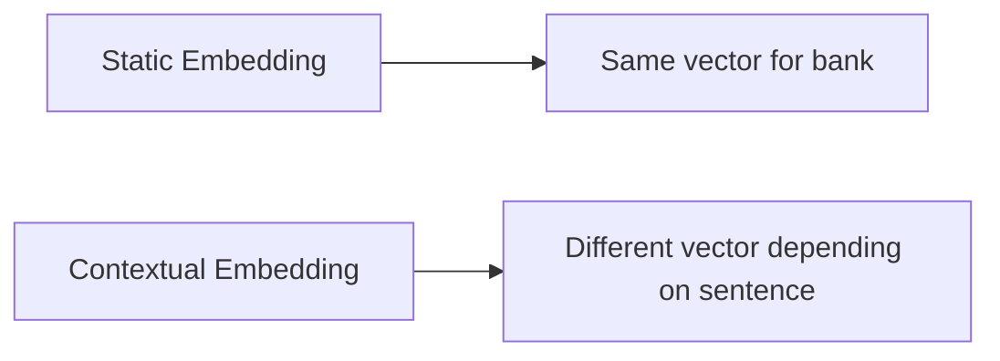
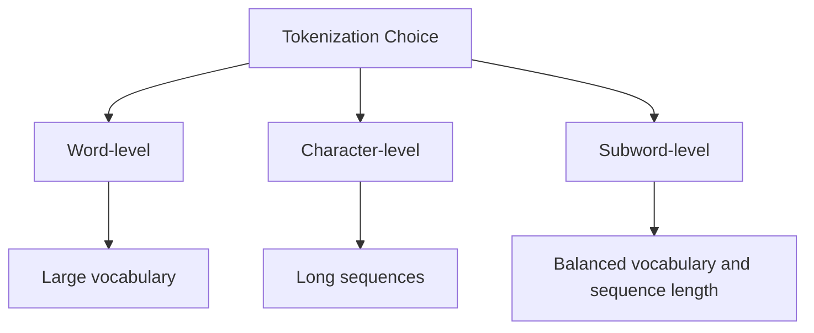
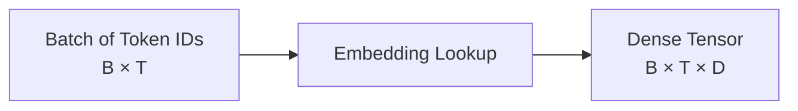
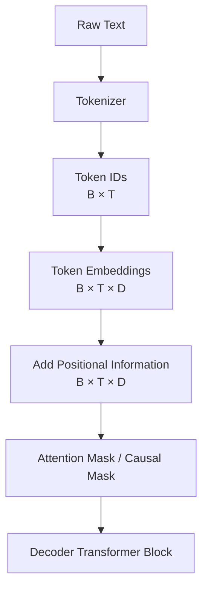
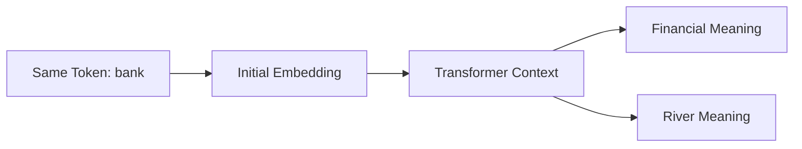

---
tags:
  - NLP
  - Embeddings
  - Tokenization
  - LLM
  - Transformers
---

# Tokenization and Vector Embeddings: Pre-Transformer Text Representation Pipelines

## 1. Pipeline Architecture

Before text can be passed into a Transformer encoder or decoder block, it must be converted into numerical representations.

A Transformer does not directly process raw text such as:

```text
The cat sat on the mat.
```

Instead, the text is converted into:

```text
text → tokens → token IDs → embedding vectors → position-aware vectors
```

Only after these steps does the sequence enter the Transformer block.


This document focuses on everything that happens **before** the Transformer block.

---

## 2. Why Text Representation Matters

Machine learning models operate on numbers, not raw text. The central question is:

```text
How do we represent words, subwords, or tokens as numbers in a useful way?
```

Different generations of NLP methods answered this question differently:

1. Bag of Words
2. TF-IDF
3. Word embeddings such as Word2Vec
4. Contextual embeddings from Transformers

Understanding this history helps explain why Transformers became so important.

---

## 3. Bag of Words

Bag of Words represents a document by counting how often each word appears.

Example vocabulary:

```text
[cat, dog, mat, sat]
```

Sentence:

```text
cat sat on mat
```

could be represented as:

```text
cat: 1
dog: 0
mat: 1
sat: 1
```

Vector form:

```text
[1, 0, 1, 1]
```


### Strengths

- Simple
- Useful for classical machine learning
- Works reasonably well for some classification problems

### Limitations

- Ignores word order
- Produces sparse high-dimensional vectors
- Does not capture meaning well
- Treats related words as unrelated

For example:

```text
cat and kitten are semantically related
```

but Bag of Words does not naturally know that.

---

## 4. TF-IDF

TF-IDF improves Bag of Words by weighting words based on how important they are in a document relative to a corpus.

The intuition:

```text
Words that appear often in one document but not everywhere are more informative.
```

Examples:

- Common words like `the`, `is`, `and` get lower weight.
- More specific words like `glacier`, `transformer`, or `genomics` may get higher weight.

### Strengths

- Better than raw counts
- Useful for search, retrieval, and classical ML pipelines

### Limitations

- Still sparse
- Still mostly ignores word order
- Still lacks deep semantic understanding
- Same word has same representation regardless of context

---

## 5. Word2Vec and Dense Word Embeddings

Word2Vec introduced a major shift: instead of sparse count vectors, words are represented as dense learned vectors.

Example:

```text
cat → [0.21, -0.42, 0.77, ..., 0.13]
dog → [0.19, -0.38, 0.75, ..., 0.09]
```

Words with similar meanings tend to have similar vectors.


### Key Idea

A word's meaning can be learned from the contexts in which it appears.

This is often summarized as:

```text
You shall know a word by the company it keeps.
```

### Example Semantic Relationship

Dense embeddings can capture relationships such as:

```text
king - man + woman ≈ queen
```

### Strengths

- Dense vectors
- Captures semantic similarity
- Much better representation than one-hot or count vectors

### Limitations

A major limitation is that each word usually has one fixed vector.

For example:

```text
bank = financial institution
bank = side of a river
```

Traditional Word2Vec-style embeddings may assign the same vector to `bank` in both contexts.

This motivates contextual embeddings.

---

## 6. From Static Embeddings to Contextual Embeddings

Static embeddings assign one vector per word or token.

Contextual embeddings produce different representations depending on surrounding words.

Example:

```text
I deposited money at the bank.
I sat by the river bank.
```

The token `bank` should have different meanings in these two sentences.

Transformers solve this by using self-attention to update token representations based on context.



This is one reason Transformers are so powerful.

---

## 7. Tokenization in Modern Transformers

Modern Transformers usually do not tokenize text strictly by words. Instead, they often use **subword tokenization**.

Example:

```text
unbelievable → un + believ + able
```

or:

```text
transformers → transform + ers
```

Subword tokenization balances two competing goals:

1. Keep vocabulary size manageable.
2. Still represent rare or unseen words.

---

## 8. Why Subword Tokenization?

If we tokenize only by whole words, the vocabulary becomes huge.

Problems:

- Many rare words
- Misspellings
- New scientific terms
- Domain-specific vocabulary
- Names and identifiers

If we tokenize only by characters, sequences become very long.

Subword tokenization is a compromise.



---

## 9. Common Tokenization Methods

Common approaches include:

- Byte Pair Encoding (BPE)
- WordPiece
- SentencePiece
- Byte-level BPE

The high-level goal is similar:

```text
Learn a vocabulary of useful text chunks.
```

These chunks may be full words, word pieces, punctuation, whitespace patterns, or byte-level units.

---

## 10. Tokenization Example

Raw text:

```text
The researcher fine-tuned a transformer model.
```

Possible tokenization:

```text
["The", "research", "er", "fine", "-", "tuned", "a", "transform", "er", "model", "."]
```

Token IDs:

```text
[464, 5210, 261, 11849, 12, 39201, 257, 18045, 261, 2746, 13]
```

The exact tokens depend on the tokenizer and vocabulary.

---

## 11. Vocabulary

The tokenizer has a fixed vocabulary.

Example vocabulary size:

```text
vocab_size = 50,000
```

Each token maps to one integer ID:

```text
"cat" → 9246
"dog" → 1897
"transform" → 18045
```

The model does not see the original token string directly. It sees the token ID.

---

## 12. Token IDs Are Not Meaningful by Themselves

Token IDs are just indices.

For example:

```text
cat → 9246
dog → 1897
```

The fact that 9246 is larger than 1897 has no semantic meaning.

The meaning comes from the embedding vectors learned for each token.

---

## 13. Embedding Matrix

The embedding layer is usually implemented as a lookup table.

If:

```text
vocab_size = 50,000
embedding_dim = 4096
```

then the embedding matrix has shape:

```text
50,000 × 4096
```

Each row corresponds to one token.

```text
embedding_matrix[token_id] → embedding vector
```


Example:

```text
token_id = 9246
embedding = embedding_matrix[9246]
```

Output:

```text
[0.12, -0.08, 0.44, ..., 0.31]
```

---

## 14. Embedding Dimension

The embedding dimension is the size of each token vector.

Common examples:

```text
small model:  d_model = 768
medium model: d_model = 1024 or 2048
large model:  d_model = 4096, 8192, or higher
```

If a sequence has 128 tokens and embedding dimension is 4096, the embedding output shape is:

```text
128 × 4096
```

For a batch of 32 sequences:

```text
batch_size × sequence_length × embedding_dim
= 32 × 128 × 4096
```

This tensor is what gets passed forward into the Transformer layers.

---

## 15. Embedding Output Shape

Given:

```text
batch_size = B
sequence_length = T
embedding_dim = D
```

The embedding output shape is:

```text
B × T × D
```

Example:

```text
B = 16
T = 512
D = 4096
```

Output shape:

```text
16 × 512 × 4096
```

This is a dense tensor representation of the tokenized batch.



---

## 16. Special Tokens

Tokenizers often include special tokens.

Examples:

```text
<BOS>  beginning of sequence
<EOS>  end of sequence
<PAD>  padding token
<UNK>  unknown token
```

Decoder-only models often use beginning/end tokens depending on model design and training setup.

Padding tokens are useful when batching sequences of different lengths.

---

## 17. Padding and Attention Masks

Sequences in a batch often have different lengths.

Example:

```text
Sentence A: 5 tokens
Sentence B: 9 tokens
Sentence C: 3 tokens
```

To batch them together, shorter sequences are padded:

```text
Sentence A: [t1, t2, t3, t4, t5, PAD, PAD, PAD, PAD]
Sentence B: [t1, t2, t3, t4, t5, t6,  t7,  t8,  t9]
Sentence C: [t1, t2, t3, PAD, PAD, PAD, PAD, PAD, PAD]
```

The model uses an attention mask so it does not treat padding tokens as meaningful content.


Important distinction:

- **Padding mask** prevents attention to padding tokens.
- **Causal mask** prevents attention to future tokens in decoder-only models.

Both masks may be used together.

---

## 18. Positional Embeddings

Token embeddings alone do not encode order.

For example:

```text
cat chased dog
dog chased cat
```

These have the same tokens but different meanings.

To represent order, positional embeddings are added:

```text
input_vector = token_embedding + positional_embedding
```

If token embedding has dimension `D`, positional embedding also has dimension `D`.

Example:

```text
token_embedding shape:     T × D
positional_embedding shape: T × D
result shape:              T × D
```

---

## 19. Learned Positional Embeddings

A learned positional embedding is a table similar to token embeddings.

If the maximum context length is 4096 and embedding dimension is 4096:

```text
position_embedding_matrix shape = 4096 × 4096
```

Each position has a learned vector:

```text
position 0 → vector
position 1 → vector
position 2 → vector
...
```

Then:

```text
input_at_position_i = token_embedding_i + position_embedding_i
```

---

## 20. Sinusoidal Positional Encoding

The original Transformer used fixed sinusoidal positional encodings.

The idea is to encode positions using sine and cosine waves of different frequencies.

This gives each position a unique pattern and may allow models to generalize to longer sequences.

The high-level takeaway:

```text
Sinusoidal encoding = fixed mathematical position signal
Learned positional embedding = learned position signal
```

---

## 21. Rotary Positional Embeddings

Many modern decoder-only models use variants such as rotary positional embeddings.

The key idea is to inject relative position information into attention by rotating query and key vectors based on token position.

High-level intuition:

```text
Instead of simply adding position vectors, position affects how tokens attend to each other.
```

This can improve long-context behavior and relative position modeling.

---

## 22. Final Input to Transformer Block

After tokenization, embedding, and positional information, the model has a tensor:

```text
B × T × D
```

Where:

```text
B = batch size
T = sequence length
D = hidden/embedding dimension
```

This tensor is passed into the first Transformer encoder or decoder block.

For decoder-only models, the next step is usually masked self-attention.



---

## 23. Why This Replaced Older Representations

Bag of Words and TF-IDF were useful but limited because they mostly ignored word order and context.

Word2Vec introduced dense semantic vectors, but each word often had a fixed representation.

Transformers moved beyond this by combining:

1. token embeddings
2. positional information
3. self-attention

This lets the model produce contextual representations.

Example:

```text
bank in "river bank" ≠ bank in "bank account"
```

The initial embedding for `bank` may start the same, but after attention layers, the representation becomes context-specific.

---

## 24. Static vs Contextual Representation

Before the Transformer block:

```text
bank → initial embedding
```

After the Transformer block:

```text
bank in financial context → contextual representation A
bank in river context     → contextual representation B
```



This is one of the most important shifts from older NLP to modern Transformer-based NLP.

---

## 25. Practical Memory Considerations

Embeddings can contain many parameters.

Example:

```text
vocab_size = 50,000
embedding_dim = 4096
```

Number of token embedding parameters:

```text
50,000 × 4096 = 204,800,000 parameters
```

So the embedding table alone can be hundreds of millions of parameters in large models.

The output projection layer may also be large because it maps from hidden dimension back to vocabulary size.

In some models, token embedding weights and output projection weights are tied to reduce parameters.

---

## 26. Summary Pipeline

The full pre-Transformer pipeline is:

```text
Raw text
→ normalize/process text as needed
→ tokenize into subwords/tokens
→ map tokens to integer IDs
→ look up token embeddings
→ add or apply positional information
→ create attention masks
→ pass tensor into Transformer block
```


---

## 27. Simple Mental Model

A good mental model is:

```text
Tokenization decides what the model's basic text units are.
Embeddings turn those units into vectors.
Positional information tells the model where each unit occurs.
The Transformer block then uses attention to make those vectors context-aware.
```

Even shorter:

```text
Tokenization creates the symbols; embeddings create the vectors; attention creates the context.
```

---

## 28. Key Terms Glossary

**Bag of Words**: Represents text by word counts, ignoring order.

**TF-IDF**: Weights words by document importance relative to a corpus.

**Word2Vec**: Learns dense static word embeddings from context.

**Static embedding**: Same vector for a word/token regardless of context.

**Contextual embedding**: Representation changes depending on surrounding tokens.

**Tokenization**: Splitting text into model-readable units.

**Subword tokenization**: Tokenization using word pieces rather than full words or characters only.

**Vocabulary**: Fixed set of tokens known by the tokenizer.

**Token ID**: Integer index assigned to a token.

**Embedding matrix**: Lookup table mapping token IDs to vectors.

**Embedding dimension**: Length of each token vector.

**Sequence length**: Number of tokens in a sequence.

**Batch size**: Number of sequences processed together.

**Padding**: Adding special tokens so sequences in a batch have equal length.

**Attention mask**: Tells the model which tokens should or should not be attended to.

**Positional embedding**: Vector representing token position.

**Causal mask**: Mask used in decoder-only models to prevent looking ahead.

---

## 29. One-Line Summary

Before text reaches a Transformer block, it is converted into token IDs, mapped into dense embedding vectors, combined with positional information, and masked appropriately so the model can process the sequence as a structured numerical tensor.
