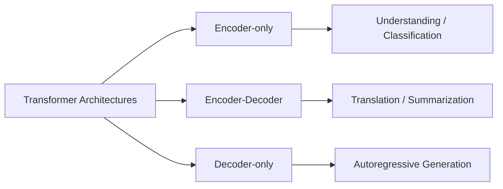
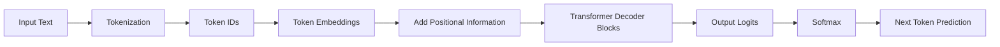
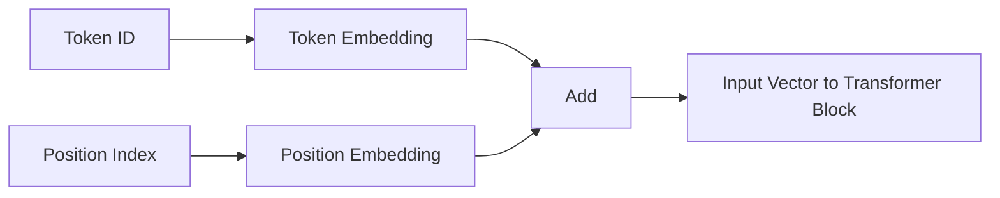
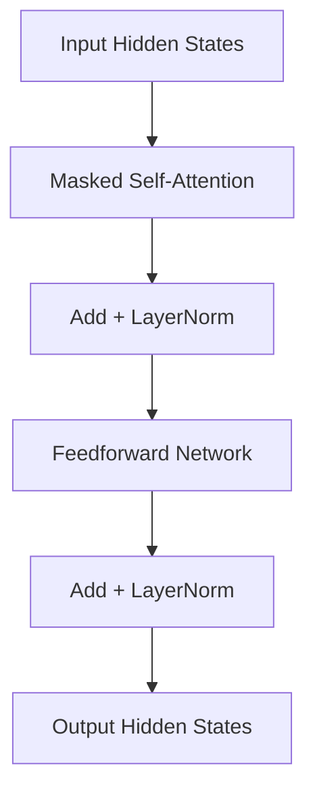
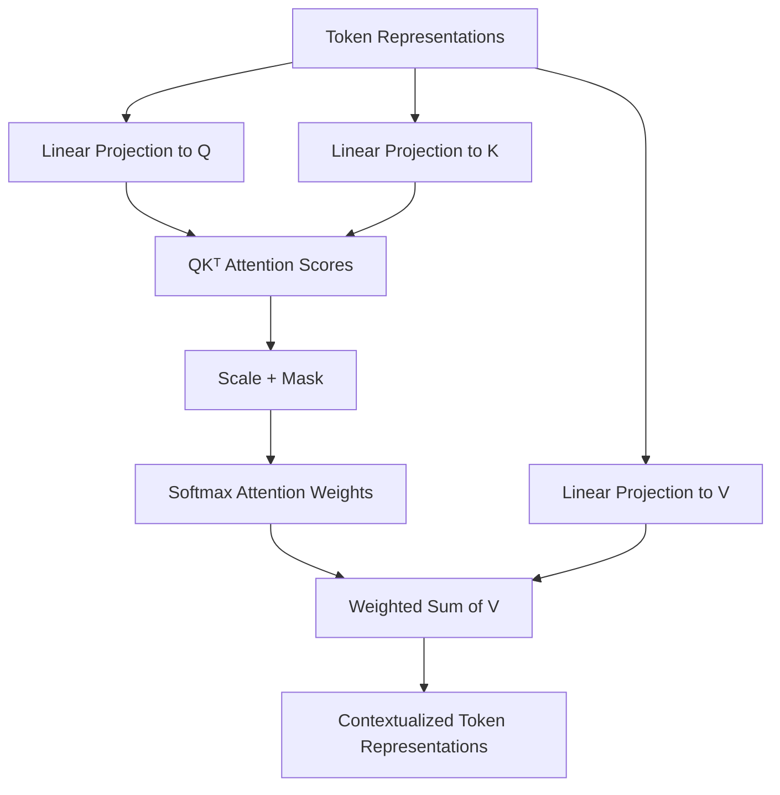
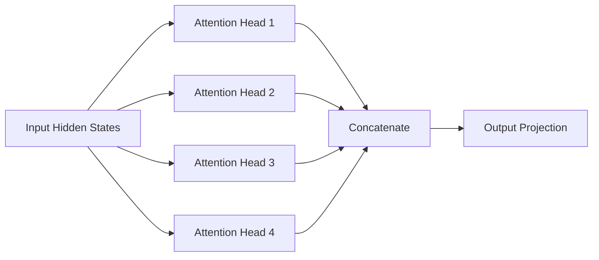
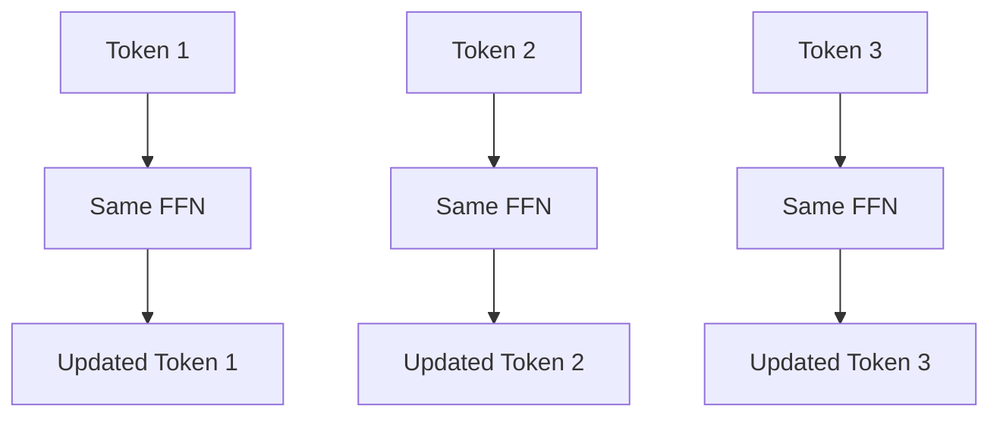
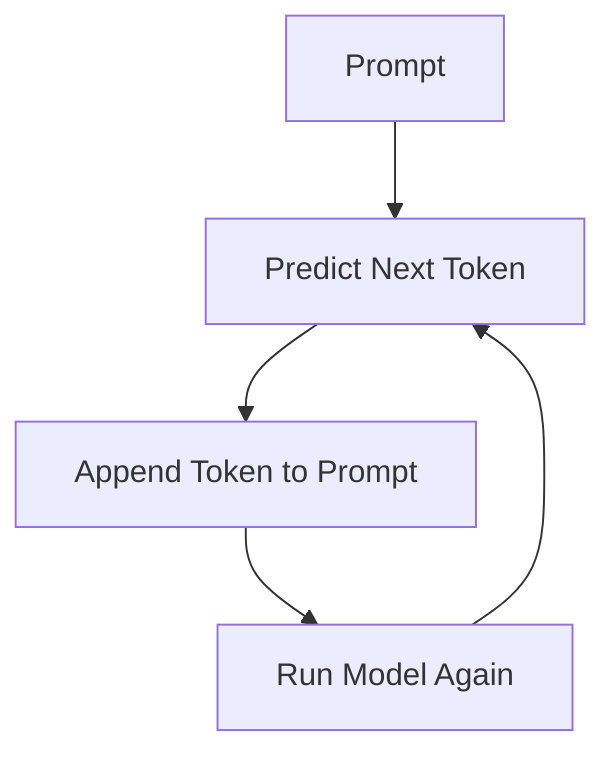
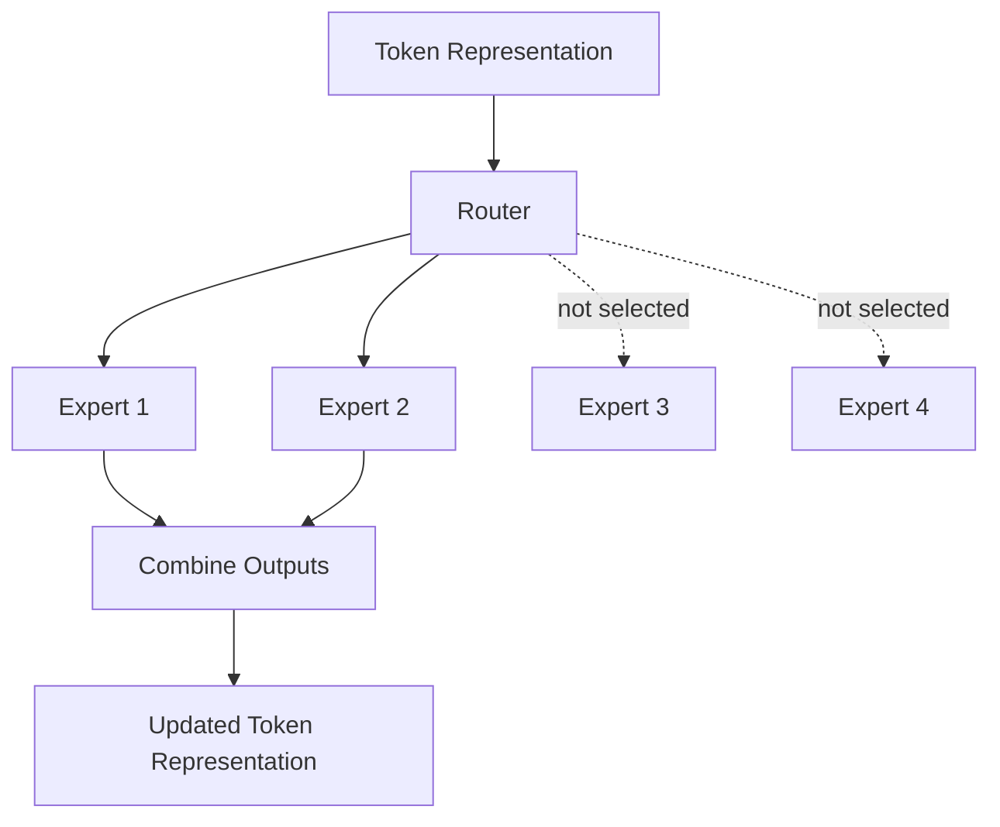

---
tags:
  - Transformers
  - Attention Mechanism
  - LLM
  - Architecture
  - Deep Learning
---

# Autoregressive Language Modeling: Decoder-Only Transformer Architectures

## 1. Mathematical Framework

A **Transformer** is a neural network architecture for sequence modeling. It was originally introduced with an **encoder-decoder** structure, but many modern generative language models use a **decoder-only** version.

A decoder-only Transformer learns the following task:

```text
Given previous tokens, predict the next token.
```

Mathematically:

```text
P(next_token | previous_tokens)
```

This is called **autoregressive modeling** because the model generates one token at a time, feeding its own output back into the input context.

---

## 2. Transformer Family: Encoder, Decoder, Encoder-Decoder

At a high level:

- **Encoder-only models** are good for understanding tasks.
  - Example use cases: classification, embeddings, retrieval, sentence similarity.
- **Encoder-decoder models** are good for sequence-to-sequence tasks.
  - Example use cases: translation, summarization, structured generation.
- **Decoder-only models** are good for open-ended generation.
  - Example use cases: chatbots, code generation, text completion.



This note focuses mainly on **decoder-only Transformers**.

---

## 3. Decoder-Only Transformer Pipeline

A decoder-only Transformer follows this conceptual flow:



In plain language:

```text
Text → tokens → vectors → attention layers → probabilities → next token
```

---

## 4. Tokenization

Neural networks do not directly understand raw text. Text is first converted into **tokens**, and each token is mapped to an integer ID.

Example:

```text
"I love machine learning"
```

might become:

```text
["I", "love", "machine", "learning"]
```

and then:

```text
[17, 482, 3912, 8401]
```

Modern language models often use **subword tokenization**, where uncommon words may be split into smaller pieces.

Example:

```text
"unbelievable" → ["un", "believ", "able"]
```

This helps the model handle rare words, new words, and multiple languages without needing a vocabulary entry for every possible word.

---

## 5. Embedding Layer

Token IDs are just arbitrary integers. The model needs to convert them into meaningful numerical vectors.

The embedding layer maps each token ID to a dense vector:

```text
token_id → embedding vector
```

Example:

```text
17 → [0.12, -0.03, 0.88, ..., 0.41]
```

If the model hidden dimension is `d_model = 4096`, each token becomes a vector of length 4096.

So an input sequence of length `N` becomes a matrix:

```text
N tokens × d_model dimensions
```

Example shape:

```text
sequence_length = 128
hidden_dimension = 4096

Embedding output shape = 128 × 4096
```

---

## 6. Positional Information

A Transformer processes tokens in parallel, so it does not naturally know token order.

For example, these two sentences contain the same words but mean different things:

```text
The dog chased the cat.
The cat chased the dog.
```

To encode order, positional information is added to token embeddings.

```text
input_representation = token_embedding + positional_embedding
```

Conceptually:



Modern models may use learned positional embeddings or variants such as rotary positional embeddings, but the high-level purpose is the same: **give the model information about order and relative position**.

---

## 7. Decoder Block Overview

A decoder-only Transformer is built by stacking many similar blocks.

Each block contains:

1. Masked self-attention
2. Feedforward neural network
3. Residual connections
4. Layer normalization

A simplified decoder block looks like this:



The complete model repeats this block many times:

```text
Embedding → Block 1 → Block 2 → Block 3 → ... → Block N → Output
```

---

## 8. Self-Attention: Core Intuition

Self-attention lets each token look at other tokens and decide which ones are important.

For example, in the sentence:

```text
The animal did not cross the street because it was tired.
```

The word `it` needs to understand what it refers to. Attention helps the model connect `it` to relevant previous tokens such as `animal`.

The key idea:

```text
Each token builds a new representation by mixing information from other tokens.
```

---

## 9. Query, Key, and Value

In self-attention, each token produces three vectors:

- **Query (Q):** what this token is looking for
- **Key (K):** what this token offers for matching
- **Value (V):** the information this token contributes

A useful analogy:

```text
Query = question
Key   = label/index
Value = content
```

The attention score between two tokens is computed using a dot product:

```text
attention_score = Q · K
```

If the query of one token matches the key of another token strongly, the attention score is high.

---

## 10. Self-Attention Step by Step

For each token:

1. Create Q, K, V vectors.
2. Compare Q with all K vectors.
3. Convert scores to probabilities using softmax.
4. Use those probabilities to compute a weighted sum of V vectors.



The common attention formula is:

```text
Attention(Q, K, V) = softmax(QKᵀ / sqrt(d_k)) V
```

Where:

- `Q` = queries
- `K` = keys
- `V` = values
- `d_k` = key/query dimension
- `sqrt(d_k)` scaling keeps dot products numerically stable

---

## 11. Causal Masking in Decoder-Only Models

Decoder-only models must not look into the future during training.

If the input is:

```text
The cat sat on the
```

and the model is predicting the next token after `cat`, it should only see:

```text
The cat
```

It should not see:

```text
sat on the
```

This is enforced using a **causal mask**.

```text
Token position i can only attend to positions ≤ i.
```

Visual example:

```text
Allowed attention matrix

          attends to →
          T1  T2  T3  T4
Token T1   ✓   x   x   x
Token T2   ✓   ✓   x   x
Token T3   ✓   ✓   ✓   x
Token T4   ✓   ✓   ✓   ✓
```

This is why decoder attention is often called **masked self-attention**.

---

## 12. Multi-Head Attention

Instead of doing attention once, Transformers use multiple attention heads in parallel.

Each head can learn different types of relationships.

Examples:

- one head may track subject-verb relationships
- another may track nearby words
- another may track long-range dependencies
- another may focus on punctuation or structure



The outputs of all heads are concatenated and projected back to the model hidden dimension.

High-level intuition:

```text
Single-head attention = one way of looking at context
Multi-head attention = many different ways of looking at context
```

---

## 13. Attention Complexity

Self-attention is powerful but expensive.

If a sequence has length `N`, each token compares itself to every other token.

That means the attention score matrix has size:

```text
N × N
```

So the complexity is approximately:

```text
O(N²)
```

Example:

```text
N = 1,000 tokens  → 1,000,000 attention interactions
N = 10,000 tokens → 100,000,000 attention interactions
```

This quadratic growth affects both compute and memory.

```mermaid
flowchart LR
    A[Sequence Length N] --> B[Attention Matrix N × N]
    B --> C[Compute Cost O(N²)]
    B --> D[Memory Cost O(N²)]
```

This is one reason long-context models are expensive and why efficient attention methods are an active area of research.

---

## 14. Feedforward Network

After attention, each token goes through a feedforward neural network.

A typical FFN looks like:

```text
Linear → Activation → Linear
```

Often the hidden dimension expands inside the FFN.

Example:

```text
d_model = 4096
ffn_hidden = 16384
```

So the FFN may expand the representation and then project it back down.

Important distinction:

```text
Attention mixes information across tokens.
FFN processes each token independently.
```



The FFN is shared across positions, but applied separately to each token.

---

## 15. Residual Connections and Layer Normalization

Deep Transformers are difficult to train without stabilizing components.

Two important tools are:

- **Residual connections**
- **Layer normalization**

A residual connection adds the input back to the output of a sublayer:

```text
x_new = x + sublayer(x)
```

Layer normalization stabilizes the scale of activations.

Conceptually:

```text
x → Attention → Add original x → Normalize
x → FFN       → Add original x → Normalize
```

These components help gradients flow through very deep networks.

---

## 16. Output Layer and Next Token Prediction

After the final Transformer block, each token has a final hidden representation.

The model projects the final hidden state into vocabulary space:

```text
hidden_state → logits over vocabulary
```

If vocabulary size is 50,000, the model outputs 50,000 scores for the next token.

Then softmax converts scores into probabilities:

```text
logits → probabilities
```

Example:

```text
P("cat")  = 0.30
P("dog")  = 0.22
P("car")  = 0.04
P("tree") = 0.01
...
```

The next token is selected from this distribution.

---

## 17. Training Objective

Decoder-only models are trained with next-token prediction.

Example training sequence:

```text
Input:  The cat sat on the
Target: cat sat on the mat
```

At every position, the model predicts the next token.

```text
The       → cat
The cat   → sat
The cat sat → on
The cat sat on → the
The cat sat on the → mat
```

The loss is usually cross-entropy loss over the vocabulary.

---

## 18. Autoregressive Generation

During inference, the model generates one token at a time.



Example:

```text
Step 1: "The"
Step 2: "The cat"
Step 3: "The cat sat"
Step 4: "The cat sat on"
Step 5: "The cat sat on the"
```

This process continues until:

- an end token is generated
- a maximum length is reached
- a stopping rule is triggered

---

## 19. Why Decoder-Only Models Are Popular for Generation

Decoder-only models are especially natural for generation because their training objective matches their inference behavior.

Training:

```text
predict next token from previous tokens
```

Inference:

```text
generate next token from previous tokens
```

This alignment makes decoder-only models simple, scalable, and effective for open-ended language generation.

---

## 20. Mixture of Experts

A standard dense Transformer uses all model parameters for every token.

This can become very expensive as models grow.

**Mixture of Experts (MoE)** changes this by replacing some dense feedforward layers with multiple expert networks.

A router decides which experts should process each token.



Example:

```text
64 total experts
only 2 experts used per token
```

This means the model can have many parameters, but only a subset is active for each token.

Benefits:

- larger model capacity
- lower compute per token than a fully dense model of similar total size
- expert specialization

Tradeoffs:

- routing complexity
- load balancing issues
- harder distributed training
- communication overhead

Simple intuition:

```text
Dense model: every token consults the whole committee.
MoE model: every token consults a few specialists.
```

---

## 21. Training vs Inference: Important Difference

Training processes many tokens in parallel and computes gradients.

Inference generates tokens sequentially.

Training:

```text
many sequences → forward → loss → backward → update
```

Inference:

```text
prompt → predict one token → append → repeat
```

During inference, models often use a **KV cache** to avoid recomputing keys and values for previous tokens at every generation step.

Without KV cache:

```text
Recompute attention history every step
```

With KV cache:

```text
Reuse previous K/V tensors and compute only for new token
```

This makes autoregressive generation much faster.

---

## 22. Why Transformers Need GPUs

Transformers are dominated by large tensor operations:

- matrix multiplications in attention
- matrix multiplications in FFN layers
- large embedding and output projection operations

GPUs are well-suited because they can execute many operations in parallel.

However, Transformers can still be limited by:

- GPU memory capacity
- memory bandwidth
- attention memory cost
- communication overhead during multi-GPU training

This is why large Transformer training often uses:

- data parallelism
- tensor/model parallelism
- pipeline parallelism
- mixed precision
- checkpointing
- distributed training systems

---

## 23. Simple Mental Model

A decoder-only Transformer can be summarized as:

```text
1. Convert text into tokens.
2. Convert tokens into vectors.
3. Add position information.
4. Let tokens attend to previous tokens.
5. Process each token with an FFN.
6. Repeat many times.
7. Predict the next token.
8. Append the token and repeat.
```

Even shorter:

```text
Tokens become vectors, vectors exchange context through attention, and the model predicts the next token.
```

---

## 24. Key Terms Glossary

**Token**: A unit of text, often a word or subword.

**Embedding**: A dense vector representation of a token.

**Position embedding**: Information added so the model knows token order.

**Self-attention**: Mechanism where tokens attend to other tokens in the same sequence.

**Causal mask**: Prevents a token from seeing future tokens.

**Attention head**: One attention mechanism inside multi-head attention.

**Multi-head attention**: Multiple attention heads operating in parallel.

**FFN**: Feedforward network applied independently to each token.

**Residual connection**: Adds input back to output to stabilize deep networks.

**LayerNorm**: Normalizes activations to improve training stability.

**Logits**: Raw output scores before softmax.

**Softmax**: Converts logits into probabilities.

**Autoregressive generation**: Generating one token at a time using previous tokens.

**MoE**: Mixture of Experts; activates only selected expert networks per token.

**KV cache**: Cached keys and values used to speed up inference.

---

## 25. One-Line Summary

A decoder-only Transformer generates text by converting tokens into vectors, repeatedly using masked self-attention to build context-aware representations, and predicting the next token autoregressively.
