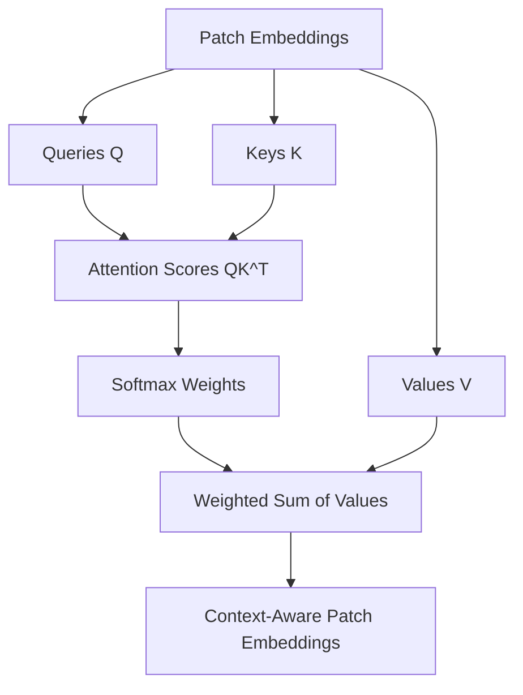

---
tags:
  - Computer Vision
  - Vision Transformers
  - Deep Learning
  - Attention
  - ViT
---

# Vision Transformers — High-Level Conceptual Primer

## 1. Big Picture

A **Vision Transformer (ViT)** applies the Transformer idea to images. In language models, text is split into tokens. In Vision Transformers, an image is split into small image patches, and each patch is treated like a token.

The core analogy is:

```text
LLM: text  → word/subword tokens → token embeddings → Transformer
ViT: image → image patches       → patch embeddings → Transformer
```

A concise mental model:

```text
A Vision Transformer turns an image into a sequence of patch tokens, adds positional information, and uses self-attention to learn relationships between different parts of the image.
```

---

## 2. From CNNs to Vision Transformers

Before Vision Transformers, **Convolutional Neural Networks (CNNs)** were the dominant architecture for computer vision.

CNNs are built around strong image-specific assumptions:

- Nearby pixels are related.
- Local patterns such as edges and textures matter.
- Features can be built hierarchically: edges → shapes → object parts → objects.
- The same filter can be useful across different image locations.

This makes CNNs very effective and data-efficient for images.

Vision Transformers take a different approach. They use fewer built-in image assumptions and instead rely on attention to learn relationships between image regions.

```text
CNN: local filters first, global understanding later
ViT: patch-to-patch attention can model global relationships early
```

---

## 3. ViT Pipeline

A standard Vision Transformer classification pipeline looks like this:


In plain language:

```text
image → patches → patch vectors → positional information → Transformer encoder → prediction
```

---

## 4. Image Patches as Tokens

The key ViT idea is to treat image patches like sequence tokens.

Example:

```text
image size = 224 × 224 × 3
patch size = 16 × 16
```

Number of patches:

```text
(224 / 16) × (224 / 16) = 14 × 14 = 196 patches
```

Each patch contains:

```text
16 × 16 × 3 = 768 raw pixel values
```

Each patch is flattened and projected into an embedding vector.

So the image becomes a sequence:

```text
196 patch tokens
```

If a CLS token is added:

```text
197 total tokens
```

This is directly analogous to a sentence becoming a sequence of text tokens.

---

## 5. Patch Embedding

A patch by itself is just a small block of pixels. The model converts each flattened patch into a dense vector using a learned linear projection.

```text
flattened patch → patch embedding
```

Example:

```text
patch size = 16 × 16 × 3 = 768 values
embedding dimension = 768
```

Then each patch becomes a vector of length 768.

For an image with 196 patches:

```text
patch embedding output shape = 196 × 768
```

For a batch of images:

```text
batch_size × number_of_patches × embedding_dim
```

This is similar to token embeddings in NLP.

---

## 6. Positional Embeddings

Transformers do not inherently know spatial order. If an image is converted into a sequence of patches, the model needs information about where each patch came from.

So ViTs add positional embeddings:

```text
input_patch_representation = patch_embedding + positional_embedding
```

Without positional information, the model would know what patches exist but not where they are located in the image.


---

## 7. Transformer Encoder in ViT

Classic ViT usually uses a **Transformer encoder**, not a decoder-only architecture.

This matters because encoder attention is generally **bidirectional**:

```text
Each patch can attend to every other patch.
```

In decoder-only LLMs, a causal mask prevents tokens from looking ahead. In image classification, the full image is available from the beginning, so no causal mask is needed.

```text
LLM decoder attention: token sees previous tokens only
ViT encoder attention: patch sees all patches
```

---

## 8. Self-Attention Over Image Patches

In ViT, self-attention lets each image patch decide which other patches are important.

For example, a patch containing part of a bird's head may attend to patches containing wings, body, or background context.

```text
patch token → attends to other patch tokens → context-aware patch representation
```

The same Q/K/V idea from Transformers applies:

- Query: what this patch is looking for
- Key: what each patch offers for matching
- Value: information contributed by each patch



---

## 9. CLS Token and Prediction Head

Many ViT models add a special learnable token called the **CLS token**.

This token is prepended to the patch sequence:

```text
[CLS], patch_1, patch_2, ..., patch_N
```

After the Transformer encoder processes the sequence, the final CLS representation is used as a summary of the image.

Then a small prediction head maps it to output classes.


Some models use pooling instead of a CLS token, but the idea is similar: produce one image-level representation for prediction.

---

## 10. Attention Complexity in ViT

Self-attention has quadratic complexity in the number of tokens:

```text
O(N²)
```

For ViT:

```text
N = number of image patches
```

This means patch size has a big impact.

Example with a 224 × 224 image:

```text
patch size 16 × 16 → 14 × 14 = 196 patches
patch size 8 × 8   → 28 × 28 = 784 patches
```

Attention interactions:

```text
196² = 38,416
784² = 614,656
```

So reducing patch size from 16 to 8 increases the number of patches by 4×, but attention cost by about 16×.

This is why high-resolution images and small patches can become expensive.

---

## 11. CNN vs ViT Intuition

CNNs and ViTs process images differently.

```text
CNN:
- uses convolution filters
- emphasizes local patterns
- builds hierarchical features naturally
- often data-efficient

ViT:
- treats image patches as tokens
- uses attention between patches
- can model global relationships directly
- often benefits from large-scale pretraining
```

A useful simplification:

```text
CNN = strong built-in image bias
ViT = flexible attention-based representation learning
```

CNNs often work very well with smaller datasets because their structure matches image properties. ViTs can be very powerful, but they often need more data, augmentation, or pretraining to perform well.

---

## 12. ViT vs Decoder-Only LLM

Vision Transformers and decoder-only language models share the Transformer mechanism, but their inputs and objectives differ.

```text
Decoder-only LLM:
text tokens → masked self-attention → next-token prediction

Vision Transformer:
image patches → bidirectional self-attention → image representation/prediction
```

Important differences:

- LLMs typically use causal masking.
- ViTs typically use full self-attention over all patches.
- LLMs usually generate sequences autoregressively.
- ViTs are often used for classification, detection, segmentation, or image representation learning.

---

## 13. Why Vision Transformers Matter

Vision Transformers showed that attention-based architectures can work very well for images when trained at sufficient scale.

They are important because they provide a unified way to think about different data types:

```text
text  → tokens
image → patches
audio → frames or spectrogram patches
video → space-time patches
```

This makes Transformers a general architecture for many modalities.

---

## 14. Extensions and Related Ideas

Several important vision models build on the ViT idea.

Examples:

- **DeiT**: data-efficient training strategies for ViTs.
- **Swin Transformer**: uses window-based attention and hierarchical structure.
- **MAE**: masked autoencoder training for images.
- **CLIP-style models**: jointly learn image and text representations.
- **Vision-language models**: combine image encoders with language models.

The central concept remains the same:

```text
convert visual input into tokens, then use attention to learn relationships.
```

---

## 15. Simple Mental Model

A Vision Transformer can be summarized as:

```text
1. Split image into patches.
2. Treat each patch like a token.
3. Convert patches into embedding vectors.
4. Add position information.
5. Use Transformer encoder layers so patches can attend to each other.
6. Use a CLS token or pooling to summarize the image.
7. Feed the summary into a prediction head.
```

Even shorter:

```text
Vision Transformer = Transformer over image patches.
```

---

## 16. One-Line Summary

A Vision Transformer extends the Transformer idea to images by treating image patches as tokens, embedding them into vectors, adding positional information, and using self-attention to learn relationships across the whole image.
