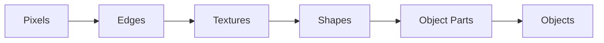
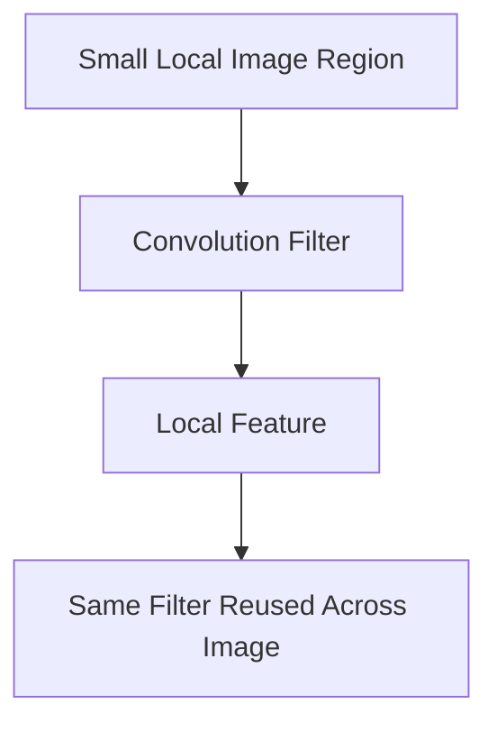
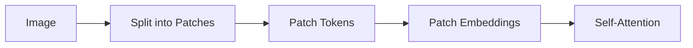
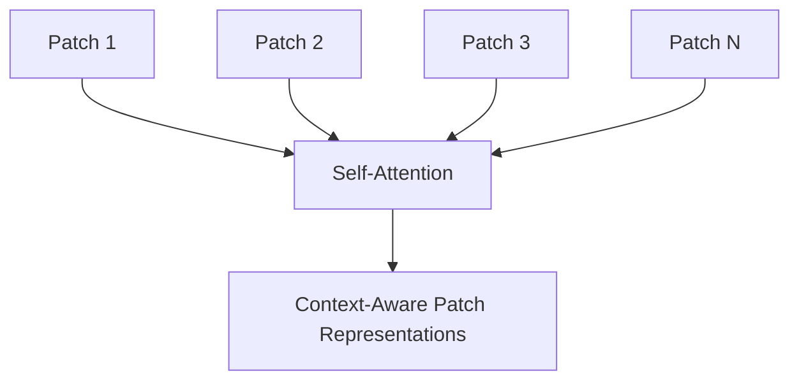
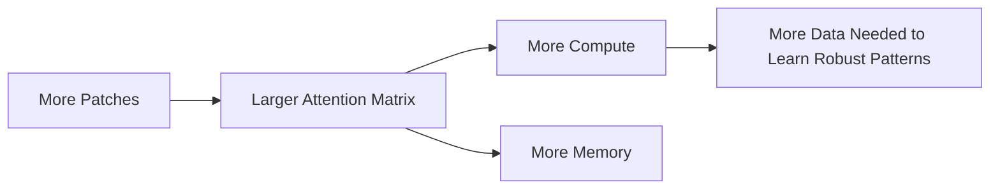
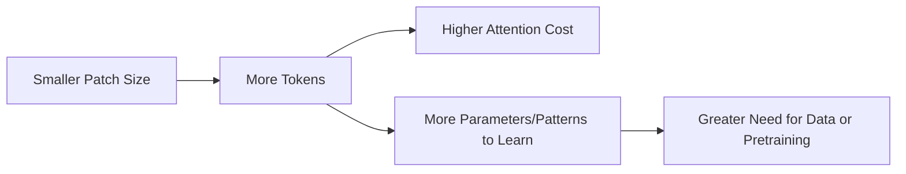
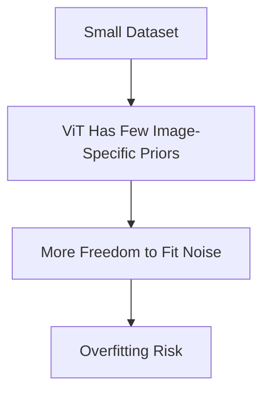
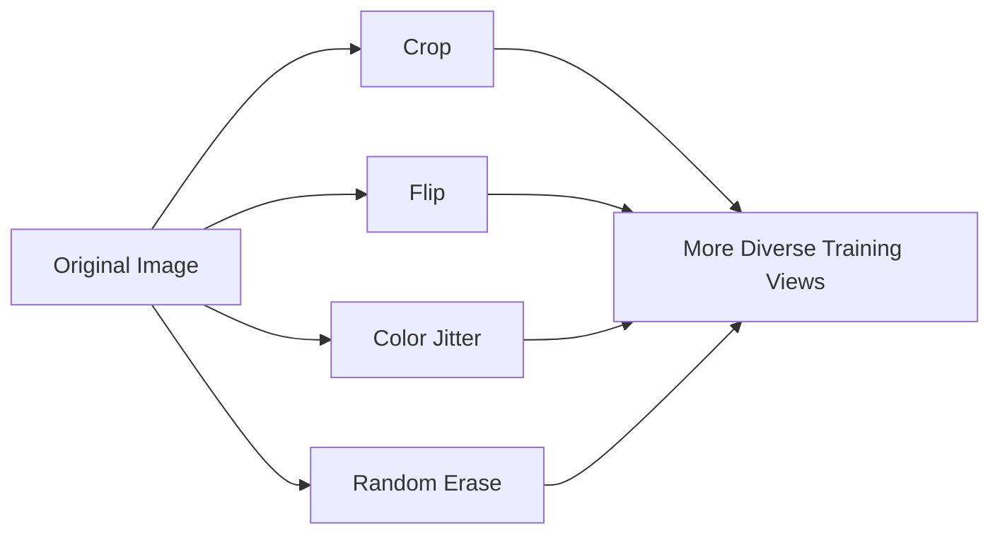
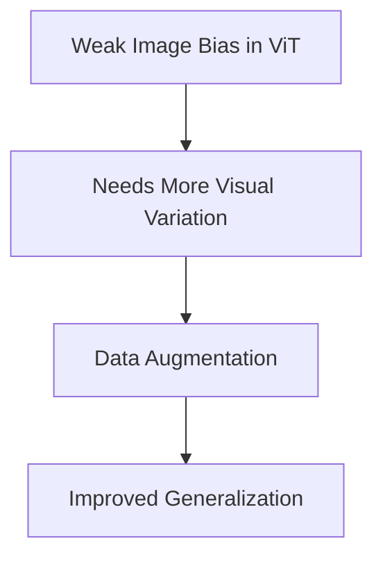
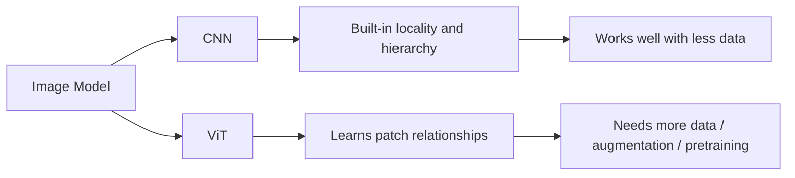

---
tags:
  - Computer Vision
  - Vision Transformers
  - Deep Learning
  - Inductive Bias
  - Transfer Learning
---

# Why Vision Transformers Often Need More Data Than CNNs

## 1. Core Idea

Vision Transformers (ViTs) often need more data than Convolutional Neural Networks (CNNs) because ViTs have **weaker image-specific inductive bias**.

```text
CNNs bake in useful assumptions about images.
ViTs learn more of those assumptions from data.
```

This makes ViTs flexible and powerful, but often more data-hungry when trained from scratch.

---

## 2. CNNs Encode Image Structure

CNNs are designed around properties of natural images:

- nearby pixels are related
- local patterns matter
- features build hierarchically
- the same visual pattern can appear anywhere



CNNs use convolution filters that slide across the image.



Key CNN inductive biases:

```text
locality + weight sharing + translation equivariance + hierarchy
```

Because these assumptions match images well, CNNs can learn effectively with less data.

---

## 3. ViTs Learn Image Structure More From Data

A ViT splits an image into patches and treats each patch like a token.



Example:

```text
224 × 224 image
patch size = 16 × 16
patch grid = 14 × 14
number of patches = 196
```

Unlike CNNs, a vanilla ViT does not strongly force the model to first learn local edges or textures. It can learn those patterns, but often needs more examples.

```text
CNN: starts with local pixel structure
ViT: starts with patch tokens and learns relationships through attention
```

---

## 4. Attention Is Flexible but Data-Hungry

Self-attention allows every patch to attend to every other patch.



This lets ViTs model global relationships early:

```text
patch containing head ↔ patch containing body
object patch ↔ background patch
nearby patch ↔ distant patch
```

But the model must learn which relationships matter.

Attention cost grows quadratically with the number of patches:

```text
attention cost ≈ O(N²)
```



---

## 5. Patch Size Affects Data and Compute Needs

Smaller patches give more detailed visual information but increase sequence length.

```text
224 × 224 image, patch 16 × 16 → 196 patches
224 × 224 image, patch 8 × 8   → 784 patches
```

Attention interactions:

```text
196² = 38,416
784² = 614,656
```

So reducing patch size from 16 to 8 increases patch count by 4× but attention interactions by about 16×.



---

## 6. Why Small Data Can Be Hard for ViTs

ViTs are flexible models with relatively weak image priors.

With small datasets, they may:

- overfit training images
- learn unstable patch relationships
- fail to learn robust local visual features
- underperform CNNs trained under similar conditions



CNNs are more constrained by architecture, which often helps them generalize better from limited image data.

---

## 7. How Data Augmentation Helps

Data augmentation artificially increases the diversity of training examples by applying label-preserving transformations.

Common augmentations include:

- random crop
- resize
- horizontal flip
- color jitter
- rotation
- random erasing
- mixup
- cutmix



Augmentation helps ViTs by encouraging the model to learn stable visual patterns rather than memorizing exact images.

```text
augmentation → more variation → less memorization → better generalization
```

For ViTs, augmentation is especially useful because it provides extra visual diversity that compensates partly for weaker built-in image bias.



---

## 8. Pretraining Also Helps

Pretraining on large datasets helps ViTs learn general visual structure before fine-tuning on a smaller task.


Common helpful strategies:

- supervised pretraining
- self-supervised learning
- masked image modeling
- contrastive image-text learning
- distillation

Practical rule:

```text
ViT from scratch on small data → may struggle
pretrained ViT + augmentation → often strong performance
```

---

## 9. CNN vs ViT Summary

```text
CNN:
- strong image-specific inductive bias
- local filters
- weight sharing
- hierarchical feature learning
- often data-efficient

ViT:
- weaker image-specific bias
- patch-based tokenization
- global self-attention
- flexible but data-hungry
- benefits strongly from augmentation and pretraining
```



---

## 10. One-Line Summary

Vision Transformers often need more data because they have weaker built-in image assumptions than CNNs; data augmentation and pretraining help by exposing the model to more visual variation and teaching robust patch relationships.
