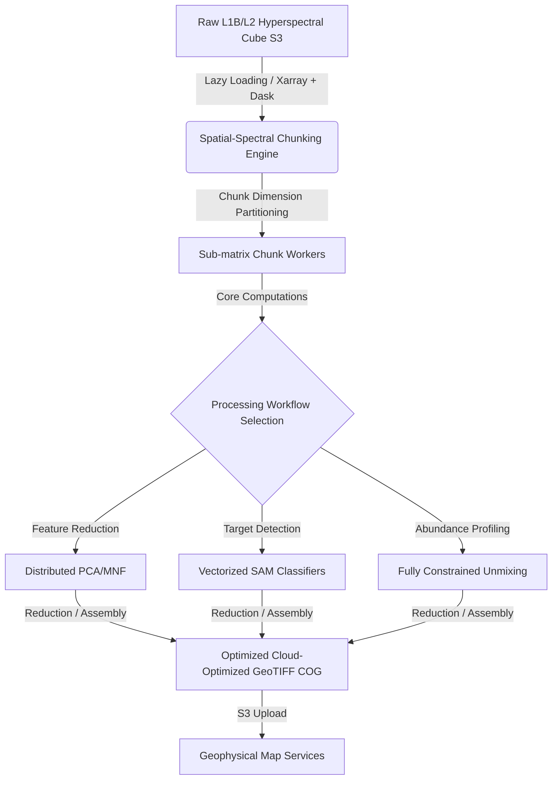

---
tags:
  - Remote Sensing
  - Hyperspectral
  - AVIRIS
  - PACE
  - Geospatial
---

# Hyperspectral Remote Sensing Concepts

## Purpose
In-depth reference notes on high-dimensional hyperspectral processing pipelines, physical radiative transfer corrections, and continuous mathematical unmixing models.

---

## 1. Hyperspectral vs. Multispectral

### Multispectral Systems
- **Bands**: 3–20 discrete spectral bands
- **Bandwidth**: 50–200 nm (broad bands)
- **Examples**: Sentinel-2 (13 bands), Landsat 8 (11 bands), MODIS (36 bands)
- **Primary Focus**: Regional land cover classifications, broad indices of vegetation and water quality.

### Hyperspectral Systems (Imaging Spectroscopy)
- **Bands**: 100–300+ continuous spectral bands
- **Bandwidth**: 5–10 nm (narrow bands)
- **Examples**: AVIRIS (224 bands), Hyperion (220 bands), NASA PACE OCI
- **Primary Focus**: Exact chemical identification, mineral mapping, precise material classification.

### Key Contrast Metrics
| Aspect | Multispectral | Hyperspectral |
|--------|---------------|---------------|
| Spectral sampling | Discrete | Continuous |
| Band width | Broad (50–200 nm) | Narrow (5–10 nm) |
| Number of bands | 3–50 | 100–300+ |
| Primary use | Land cover, indices | Material identification |
| Data volume | Moderate | Large |
| Processing complexity | Lower | Higher |

### Unified Process Transferability
- **Radiometric Calibration**: The core physical principles (converting cell values to radiance and reflectance) remain identical but scale significantly in dimensionality.
- **Atmospheric Modeling**: Decoupling water vapor absorption and scattering spans identical physics but requires much finer spectral band integration models.
- **Multidimensional Processing**: Transitioning from 2D layers to 3D/4D spatial-spectral cubes leverages aligned `xarray` and `rioxarray` array architectures.
- **Verification Standards**: Validating derived geophysical products relies on in-situ target networks and statistical metric matrices (RMSE, confusion matrices).

---

## 2. Spectral Angle Mapper (SAM)

### Concept
Measures **spectral similarity** as the angle between two vectors in n-dimensional spectral space.

### Mathematical Formula
```
SAM(pixel, reference) = arccos( (pixel · reference) / (||pixel|| × ||reference||) )
```

Where:
- `·` = dot product
- `||vector||` = Euclidean norm (magnitude)
- Result in radians (0 to π/2)

### Intuition
- **Geometrically**: Angle between two vectors in n-dimensional space (n = number of bands)
- **Smaller angle** = more similar spectra
- **Threshold**: Classify if angle < threshold (e.g., 0.1 radians)

### Advantages
1. **Illumination invariant**: Normalization removes brightness effects
2. **Simple to implement**: Just dot product and norms
3. **Fast computation**: Vectorizes well for large images
4. **Interpretable**: Angle has physical meaning

### Disadvantages
1. **Ignores magnitude**: Bright and dark versions of same material look identical
2. **No statistical basis**: Unlike Mahalanobis distance or SVM
3. **Fixed threshold**: Requires manual tuning

### Python Implementation (Conceptual)
```python
import numpy as np

def spectral_angle_mapper(pixel_spectrum, reference_spectrum):
    """
    Calculate SAM angle between pixel and reference spectrum.
    
    Args:
        pixel_spectrum: 1D array of reflectance values (n_bands,)
        reference_spectrum: 1D array of reference reflectance (n_bands,)
    
    Returns:
        angle: SAM angle in radians
    """
    # Dot product
    dot_product = np.dot(pixel_spectrum, reference_spectrum)
    
    # Norms (magnitudes)
    norm_pixel = np.linalg.norm(pixel_spectrum)
    norm_ref = np.linalg.norm(reference_spectrum)
    
    # Cosine of angle
    cos_angle = dot_product / (norm_pixel * norm_ref)
    
    # Clip to valid range [-1, 1] to avoid numerical errors
    cos_angle = np.clip(cos_angle, -1, 1)
    
    # Angle in radians
    angle = np.arccos(cos_angle)
    
    return angle

# For full image classification:
# sam_map = np.array([[spectral_angle_mapper(cube[i,j,:], ref) 
#                      for j in range(cols)] for i in range(rows)])
```

### Architectural Best Practices for Cosine Invariance
SAM behaves conceptually as a cosine similarity calculator across high-dimensional feature dimensions. In ML pipeline processing, measuring vector cosine angle is preferred over raw Euclidean distance because it isolates spectral shape characteristics while removing amplitude offsets. This mathematical characteristic provides excellent illumination-invariance, ensuring that terrain shadows, changes in local solar elevation angles, or localized clouds do not skew classification targets. However, because additive effects (such as atmospheric scattering) shift vectors instead of scaling them, applying rigorous atmospheric subtraction models prior to running SAM is crucial to maintaining accuracy.

---

## 3. Spectral Unmixing

### Concept
Each pixel's reflectance is a **mixture of multiple materials** (endmembers). Unmixing decomposes the pixel into **fractional abundances** of each endmember.

### Linear Mixing Model
```
R_pixel(λ) = Σ [f_i × R_i(λ)] + ε(λ)

Where:
- R_pixel(λ) = observed pixel reflectance at wavelength λ
- R_i(λ) = endmember i reflectance at wavelength λ
- f_i = fractional abundance of endmember i (0 ≤ f_i ≤ 1)
- ε(λ) = error/noise
```

### Constraints
1. **Sum-to-one**: Σ f_i = 1 (abundances sum to 100%)
2. **Non-negativity**: f_i ≥ 0 (can't have negative fractions)

### Types

#### Linear Spectral Unmixing
- **Assumption**: Photons interact with only one material before reaching sensor (surface scattering)
- **Method**: Solve constrained least squares problem
- **When valid**: Most remote sensing scenarios

#### Nonlinear Unmixing
- **Assumption**: Photons interact with multiple materials (multiple scattering)
- **Method**: More complex optimization (neural networks, kernel methods)
- **When needed**: Dense vegetation canopies, complex scenes

### Workflow Steps

#### 1. Endmember Extraction
**Goal**: Identify pure material spectra (endmembers)

**Methods**:
- **PPI (Pixel Purity Index)**: Find extreme pixels in convex hull
- **N-FINDR**: Maximize volume of simplex in spectral space
- **VCA (Vertex Component Analysis)**: Geometric approach
- **Manual selection**: Use known pure pixels or spectral library

#### 2. Abundance Estimation
**Goal**: Solve for fractional abundances given endmembers

**Methods**:
- **Unconstrained Least Squares (LSU)**: Fast but can violate constraints
- **Non-Negative Least Squares (NNLS)**: Enforces f_i ≥ 0
- **Fully Constrained Least Squares (FCLS)**: Enforces sum-to-one + non-negativity

#### 3. Validation
- Check residual error (how well model fits observed spectrum)
- Verify abundances make physical sense
- Compare to ground truth if available

### Python Implementation (Conceptual)
```python
from scipy.optimize import nnls
import numpy as np

def linear_unmixing_nnls(pixel_spectrum, endmembers):
    """
    Unmix pixel using Non-Negative Least Squares.
    
    Args:
        pixel_spectrum: 1D array (n_bands,)
        endmembers: 2D array (n_endmembers, n_bands)
    
    Returns:
        abundances: 1D array (n_endmembers,) - fractional abundances
    """
    # Solve: minimize ||pixel - Σ(abundance_i × endmember_i)||^2
    # subject to: abundance_i ≥ 0
    abundances, residual = nnls(endmembers.T, pixel_spectrum)
    
    # Optional: normalize to sum-to-one
    abundances_normalized = abundances / abundances.sum()
    
    return abundances_normalized

# For full image:
# abundance_maps = np.zeros((rows, cols, n_endmembers))
# for i in range(rows):
#     for j in range(cols):
#         abundance_maps[i, j, :] = linear_unmixing_nnls(cube[i,j,:], endmembers)
```

### Optimization Formulations and Physical Constraints
Linear spectral unmixing is mathematically framed as a constrained linear regression task. Because abundance values correspond to physical area occupancy, enforcing Non-Negativity (ANC) and Sum-to-One (ASC) transforms unconstrained least-squares into a bounded convex optimization problem. Resolving these systems across planetary-scale datasets requires high-performance convex solvers (such as CVXPY or BVLS) capable of distributing array bounds calculations efficiently over multi-threaded nodes.

---

## 4. Dimensionality Reduction

### Why Reduce Dimensionality?
1. **Noise**: Not all bands contain useful signal
2. **Redundancy**: Adjacent hyperspectral bands highly correlated
3. **Computational cost**: 200+ bands = expensive processing
4. **Curse of dimensionality**: ML classifiers struggle in high dimensions

### Principal Component Analysis (PCA)

#### Concept
Transform correlated bands into **uncorrelated principal components** ordered by variance explained.

#### Steps
1. Standardize data (mean=0, variance=1)
2. Compute covariance matrix
3. Compute eigenvectors and eigenvalues
4. Sort by eigenvalue (variance explained)
5. Project data onto top k eigenvectors

#### Output
- **PC1**: Direction of maximum variance (often brightness)
- **PC2**: Second-most variance (often greenness)
- **PC3+**: Progressively less variance (often noise)

#### Typical Result
- **First 5-10 PCs** capture 95%+ of variance
- **Remaining 200+ PCs** mostly noise

#### Python (Scikit-learn)
```python
from sklearn.decomposition import PCA

# Reshape cube to 2D: (n_pixels, n_bands)
pixels = hypercube.reshape(-1, n_bands)

# Apply PCA
pca = PCA(n_components=10)  # Keep 10 components
pcs = pca.fit_transform(pixels)

# Reshape back to image
pc_cube = pcs.reshape(n_rows, n_cols, 10)

print(f"Variance explained: {pca.explained_variance_ratio_}")
```

### Minimum Noise Fraction (MNF)

#### Concept
PCA variant that **separates signal from noise** by maximizing SNR (Signal-to-Noise Ratio).

#### Difference from PCA
- **PCA**: Maximizes total variance (signal + noise)
- **MNF**: Maximizes signal variance relative to noise variance

#### Steps
1. Estimate noise covariance matrix (from dark pixels or repeat observations)
2. Apply noise whitening transformation
3. Apply PCA to whitened data
4. Invert transformation

#### Output
- **Early MNF components**: High SNR (signal-dominated)
- **Late MNF components**: Low SNR (noise-dominated)

#### When to Use
- MNF better than PCA when noise levels vary by band (common in hyperspectral)
- PCA sufficient for many applications

### Feature Extraction and Noise Discrimination Metrics
Dimensionality reduction is a Standard Machine Learning practice, directly equivalent to high-dimensional feature engineering. Projecting 200+ continuous bands onto 10 principal components reduces downstream computational costs while preserving 95%+ of the coherent physical signal. In operational environments, Minimum Noise Fraction (MNF) is preferred over standard PCA wrapper models because MNF incorporates a noise covariance matrix, ensuring components are sorted and selected based on signal-to-noise ratios rather than raw total variance (which can be contaminated by noisy, unstable bands).

---

## 5. Atmospheric Correction

### Problem
**At-sensor radiance ≠ Surface reflectance**

Atmosphere affects measurements through:
1. **Scattering**: Rayleigh (molecules), Mie (aerosols), non-selective (large particles)
2. **Absorption**: Water vapor, O₂, O₃, CO₂

### Goal
Remove atmospheric effects to recover **surface reflectance** (what we actually care about).

### Models (Know Names, Not Implementation Details)

#### MODTRAN (MODerate resolution atmospheric TRANsmission)
- **Type**: Physics-based radiative transfer model
- **Status**: Gold standard, very complex
- **Inputs**: Atmospheric profile (pressure, temperature, water vapor, aerosols), viewing geometry, solar angles
- **Use**: Research, high-accuracy applications
- **Your Positioning**: "Know it's the gold standard; would use existing implementations or libraries"

#### 6S (Second Simulation of Satellite Signal in the Solar Spectrum)
- **Type**: Radiative transfer model (simpler than MODTRAN)
- **Status**: Open-source, widely used in research
- **Inputs**: Similar to MODTRAN but fewer parameters
- **Use**: Academic research, open-source projects
- **Python**: `Py6S` package available

#### FLAASH (Fast Line-of-sight Atmospheric Analysis of Spectral Hypercubes)
- **Type**: Commercial implementation (ENVI software)
- **Status**: Industry standard for hyperspectral correction
- **Use**: Operational processing, commercial applications

#### Empirical Line Calibration (ELC)
- **Type**: Simple empirical method
- **Approach**: Use ground targets with known reflectance to calibrate
- **Requirements**: At least 2 targets (bright and dark) with known spectra
- **Advantage**: No atmospheric profile needed
- **Disadvantage**: Less accurate, spatially variable if atmospheric conditions change

### Simplified Equation (Conceptual)
```
L_sensor = (L_surface × τ) + L_path

Where:
- L_sensor = at-sensor radiance (what satellite measures)
- L_surface = surface radiance (what we want)
- τ = atmospheric transmittance (0-1)
- L_path = path radiance (atmospheric scattering adding signal)
```

### Analytical Calibration and Physical Decoupling Workflows
Modern earth observation architectures standardize on surface reflectance rather than raw at-sensor values to guarantee regional and temporal code reproducibility. Physical-based decoupling pipelines typically execute three distinct processes:
1.  **Radiometric Calibration**: Transitioning raw digital count values (DN) to spectral radiance using calibrated pre-launch and on-orbit sensitivity tables.
2.  **Atmospheric Decoupling**: Subtracting molecular Rayleigh scattering, ozone absorption bands, and aerosol Mie functions using rigorous physical radiative transfer engines (such as MODTRAN, 6S, or commercial FLAASH processors) to isolate pure water-leaving reflectance.
3.  **Sensor Validation**: Mathematically testing output reflectance slices against in-situ target measurements to quantify residual optical errors.

For rapid exploratory telemetry or localized validation campaigns where active regional atmospheric profiles are unavailable, the **Empirical Line Calibration (ELC)** approach provides a straightforward alternative by establishing linear regression scales directly over known bright and dark ground targets.

---

## 6. Spectral Libraries & Reference Data

### Purpose
Reference spectra for known materials to use in classification or unmixing.

### Major Spectral Libraries

#### USGS Spectral Library
- **Coverage**: Minerals, rocks, soils, vegetation, man-made materials
- **Bands**: Laboratory measurements, 0.4-2.5 μm (hyperspectral resolution)
- **Access**: Free, public (https://www.usgs.gov/labs/spec-lab)
- **Use Case**: Mineral identification, geological applications

#### NASA/JPL ASTER Spectral Library
- **Coverage**: Rocks, minerals, vegetation, snow, ice, water, man-made
- **Bands**: 0.4-15 μm (includes thermal)
- **Access**: Free, public
- **Use Case**: General remote sensing applications

#### AVIRIS Spectral Library
- **Coverage**: Vegetation types, minerals
- **Native Resolution**: Matches AVIRIS sensor
- **Use Case**: AVIRIS data analysis

### Field Spectrometry
- **Instrument**: Handheld spectrometer (e.g., ASD FieldSpec)
- **Use**: Collect in-situ measurements for validation
- **Workflow**: Measure reference targets during satellite overpass

### Spectral Registry Integration and Field Validation Reference
For model training and linear unmixing, accessing validated public registries (such as the USGS, NASA JPL ASTER, and AVIRIS spectral libraries) provides critical reference signatures of known geological and biological materials. For localized campaigns, these libraries are augmented with on-site, high-resolution measurements collected via handheld field spectrometers to compute site-specific endmember profiles.

---

## 7. Validation & Accuracy Assessment

### Ground Truth Sources

#### 1. Field Spectrometry
- **Method**: Handheld spectrometer measurements during overpass
- **Advantage**: Direct spectral validation
- **Challenge**: Spatial mismatch (point vs. pixel), timing synchronization

#### 2. Reference Datasets
- **Higher Resolution Imagery**: Compare to commercial 1-2m imagery
- **Existing Products**: Compare to validated products (e.g., USGS mineral maps)
- **In-Situ Sampling**: Lab analysis of collected samples

#### 3. Physics Checks
- **Reflectance Range**: Should be 0-1 (or 0-100%)
- **Spectral Shape**: Does it match expected material signature?
- **Endmember Abundances**: Do they sum to ~1? Are they non-negative?

### Statistical Metrics

#### Classification Accuracy
- **Confusion Matrix**: Class-by-class performance
- **Overall Accuracy**: (Correct predictions) / (Total predictions)
- **Producer's Accuracy**: How often ground truth class correctly predicted
- **User's Accuracy**: How often prediction is correct
- **Kappa Coefficient**: Agreement beyond chance

#### Regression (Continuous Values)
- **RMSE**: Root Mean Square Error
- **Bias**: Systematic over/under-estimation
- **R²**: Coefficient of determination (variance explained)

### Cross-Validation
- **Spatial CV**: Train/test split by geographic location (avoid spatial autocorrelation)
- **Temporal CV**: Train on one acquisition, test on another
- **K-fold CV**: Standard ML practice

### Spatial Cross-Validation and Scientific Error Metrics
Accuracy estimation of continuous and categorical spatial products must account for spatial autocorrelation (Tobler's First Law of Geography), where adjacent training and testing pixels violate independent and identically distributed (i.i.d.) assumptions. To prevent optimistic bias, model deployment processes should implement spatial cross-validation, segmenting training folds geographically so training and testing regions maintain physical spatial distance boundaries. Standard evaluation matrices include multi-class confusion matrices (for categorical mapping) alongside continuous regression diagnostics such as Root Mean Square Error (RMSE), systematic bias, and coefficient of determination ($R^2$, for continuous values like chemical concentrations or fractional abundances).

---

## 8. Summary: Hyperspectral Workflow

### End-to-End Pipeline

```
1. Data Acquisition
   ├─ Hyperspectral sensor (airborne/spaceborne)
   └─ Ground truth (field spectrometry, sampling)

2. Preprocessing
   ├─ Radiometric calibration (DN → radiance)
   ├─ Atmospheric correction (radiance → surface reflectance)
   ├─ Geometric correction (orthorectification)
   └─ Noise reduction (optional: smoothing, destriping)

3. Dimensionality Reduction (optional)
   ├─ PCA or MNF to reduce bands
   └─ Improves computational efficiency

4. Analysis
   ├─ Spectral indices (vegetation, mineral, water)
   ├─ Classification (SAM, SVM, Random Forest)
   ├─ Unmixing (endmember extraction → abundance mapping)
   └─ Change detection (temporal analysis)

5. Validation
   ├─ Compare to ground truth
   ├─ Statistical metrics (accuracy, RMSE)
   └─ Physics checks (sensible values?)

6. Delivery
   ├─ Classified maps, abundance maps, data products
   ├─ Uncertainty/confidence layers
   └─ Documentation and metadata
```

---

```

---

## 9. Cloud Deployment and Scalability Architecture

### Scalable High-Dimensional Pipelines
Deploying hyperspectral algorithms to processing pipelines requires explicit design consideration for high-dimensional data volumes. A single typical hyperspectral flight line or planetary tile may exceed 10–50 GB, meaning standard in-memory single-threaded architectures will trigger Out-of-Memory (OOM) failures under heavy matrix routines.



### Key Architectural Solutions

#### 1. In-Memory Array Chunking and Lazy Loading
- **Xarray + Dask Integration**: Reframe traditional numpy workloads by wrapping them in multi-dimensional `xarray.DataArray` structures with backing `Dask` engines. This enables lazy-evaluating execution graphs across continuous bands, delaying array loading until specific subset computations require realization.
- **Optimal Spatial-Spectral Chunk Size**: Segment arrays using medium spatial boundaries (e.g., $1000 \times 1000$ pixels) while maintaining the entire spectral channel length in single chunks (e.g., `(1000, 1000, n_bands)`). This configuration prevents broken, fragmented memory operations during contiguous vector-wise calculations (such as SAM dot products or unmixing optimizations).

#### 2. Vectorized Spectral Operations
- Replace all raw loop segments (`for i in range(rows)...`) with native numpy/scipy matrix operations or broadcasting geometries. 
- Leverage optimized library wrappers (like Spectral Python `spectral`, Scikit-learn, and CuPy for GPU acceleration) to perform parallel vector matching, ensuring high execution performance.

#### 3. Automated Automated Verification and QA Gates
- Integrate physical threshold validations as automated pipeline testing steps upon data ingestion:
  - **Reflectance Bound Checks**: Enforce hard clipping bounds [0, 1] on target reflectance spectrum slices to detect faulty atmospheric subtraction segments.
  - **Unmixing Integrity**: Enforce $\sum f_i \approx 1$ and $f_i \ge 0$ parameters during fractional abundance outputs to guarantee physical validity.

---

## Resources for Continued Learning

### Books
- "Hyperspectral Remote Sensing" by Michael T. Eismann
- "Hyperspectral Imaging: Techniques for Spectral Detection and Classification" by Chein-I Chang

### Online
- NASA ARSET: Fundamentals of Remote Sensing
- Spectral Python documentation: http://www.spectralpython.net/
- USGS Spectral Library: https://www.usgs.gov/labs/spec-lab

### Papers
- Kruse et al. (1993) - Original SAM paper
- Bioucas-Dias et al. (2012) - Hyperspectral unmixing review
- Plaza et al. (2009) - Recent advances in hyperspectral image processing
